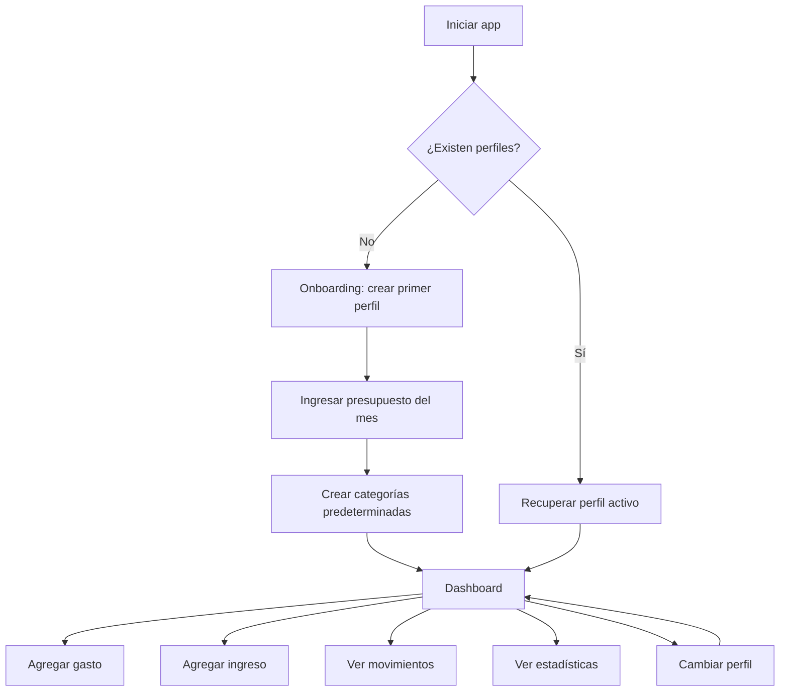
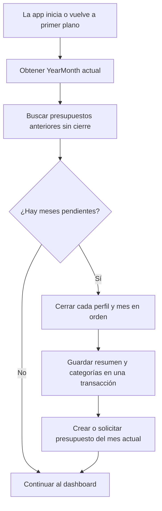
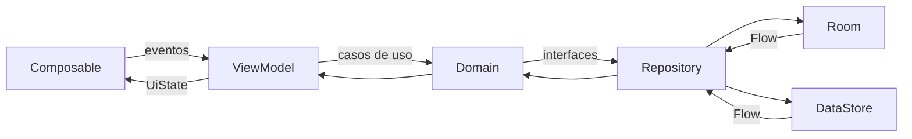
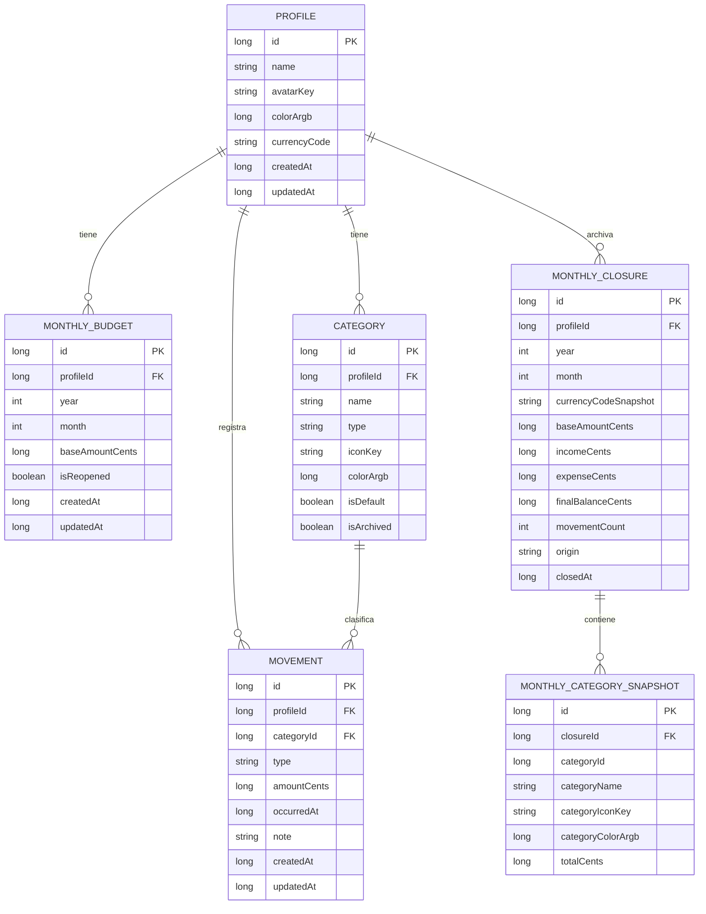

# Guía de desarrollo: app de gastos multiperfil con Jetpack Compose y MVVM

> Documento funcional y técnico para construir una aplicación Android local, simple, atractiva e intuitiva que permita administrar presupuestos mensuales, ingresos, gastos y cierres mensuales automáticos de múltiples perfiles independientes.

**Fecha de la guía:** 12 de julio de 2026  
**Plataforma:** Android  
**Lenguaje:** Kotlin  
**UI:** Jetpack Compose + Material 3  
**Arquitectura:** MVVM, flujo unidireccional de datos y capas `ui` / `domain` / `data`  
**Persistencia:** Room + DataStore  
**Inyección de dependencias:** Hilt  
**Funcionamiento inicial:** 100 % local y sin autenticación

---

## 1. Objetivo del producto

La aplicación debe permitir que una persona cree varios perfiles locales, por ejemplo:

- Santiago
- Sofi
- Gastos del hogar
- Vacaciones

Cada perfil funciona como un espacio financiero separado. Sus presupuestos, ingresos, gastos, categorías, historial y estadísticas no se mezclan con los de otros perfiles.

Para cada perfil, el usuario podrá:

1. Definir el monto inicial disponible para cada mes.
2. Registrar gastos indicando monto, categoría, fecha y nota opcional.
3. Registrar ingresos adicionales con su fecha correspondiente.
4. Modificar el monto inicial del mes.
5. Consultar el saldo restante.
6. Agrupar gastos por categoría.
7. Ver un gráfico de torta o dona con la distribución de gastos.
8. Buscar movimientos por descripción, categoría o monto.
9. Consultar, editar y eliminar movimientos del mes abierto.
10. Cerrar automáticamente cada mes y generar un resumen histórico.
11. Consultar meses anteriores con saldo final y gastos por categoría.
12. Reabrir un mes histórico de forma explícita si necesita corregirlo.
13. Cambiar rápidamente de perfil.

---

## 2. Decisiones principales de diseño

### 2.1 Los perfiles son locales

En la primera versión no existe login, servidor ni sincronización. Todos los perfiles viven dentro de la misma instalación de la aplicación.

Esto mantiene el proyecto simple y permite usarlo sin conexión. Un perfil no equivale a una cuenta online.

### 2.2 El presupuesto mensual no se guarda directamente en el perfil

Aunque en la interfaz el usuario configura su monto inicial al crear el perfil, técnicamente ese monto se guarda en una entidad mensual independiente.

Esto evita un error común: si el sueldo se almacenara en `ProfileEntity`, cambiarlo en julio también modificaría indirectamente la interpretación de junio, mayo y meses anteriores.

La estructura correcta es:

```text
Perfil
 ├── Presupuesto julio 2026
 ├── Presupuesto agosto 2026
 ├── Presupuesto septiembre 2026
 └── ...
```

### 2.3 Hay dos acciones distintas para aumentar el dinero disponible

#### Agregar ingreso

Crea un movimiento de tipo `INCOME` y queda registrado en el historial.

Ejemplos:

- Cobro de sueldo adicional
- Venta de un objeto
- Reintegro
- Transferencia recibida
- Trabajo extra

#### Editar presupuesto inicial

Modifica el monto base del mes seleccionado.

Ejemplo:

- El usuario cargó por error `$1.500.000` y luego lo corrige a `$1.650.000`.

La interfaz debe presentar ambas acciones de forma separada para evitar confusión.

### 2.4 El dinero nunca se guarda como `Double`

Todos los montos se almacenan en centavos usando `Long`.

```kotlin
val amountCents: Long
```

Ejemplos:

```text
$ 1.500,00  -> 150000 centavos
$ 23.450,75 -> 2345075 centavos
```

Esto evita errores de precisión de punto flotante.

### 2.5 Un gasto puede superar el saldo disponible

La aplicación no debe bloquearlo. Debe permitir registrarlo y mostrar:

- saldo negativo;
- una advertencia visual;
- el porcentaje excedido.

Bloquear el movimiento produciría un historial falso.

### 2.6 Las categorías usadas no se eliminan físicamente

Si una categoría ya tiene movimientos asociados, se archiva en vez de eliminarse. De esta manera, los gastos históricos continúan mostrando correctamente su categoría.

### 2.7 Cada mes se cierra y se convierte en historial

Cuando comienza un mes nuevo, la aplicación debe cerrar todos los meses anteriores que todavía estén abiertos para cada perfil. El cierre crea un resumen persistido con:

- presupuesto base;
- ingresos totales;
- gastos totales;
- saldo final;
- cantidad de movimientos;
- distribución de gastos por categoría;
- fecha y origen del cierre.

El historial no depende únicamente de volver a calcular consultas sobre movimientos antiguos. Se guarda un **snapshot** para conservar exactamente cómo terminó el mes, incluso si después se cambia el nombre, color o icono de una categoría.

La existencia de un `MonthlyClosureEntity` indica que el mes está cerrado. Un mes cerrado se muestra como solo lectura. Para corregirlo, el usuario debe tocar `Reabrir mes`, realizar los cambios y volver a cerrarlo.

`MonthlyBudgetEntity.isReopened` evita que la comprobación automática vuelva a cerrar inmediatamente un mes histórico que el usuario abrió para corregir. Los meses reabiertos se excluyen del cierre automático hasta que la persona confirme `Guardar cambios y cerrar nuevamente`.

El cierre automático debe ser idempotente: ejecutarlo dos veces para el mismo `profileId + año + mes` nunca puede duplicar el historial.

No conviene depender de una ejecución exacta a las `00:00`. La fuente de verdad será `EnsureClosedMonthsUseCase`, ejecutado al iniciar o volver a primer plano la aplicación. WorkManager puede ejecutar la misma verificación periódicamente como respaldo, pero su hora real de ejecución puede retrasarse por optimizaciones del sistema.

El saldo final no se arrastra automáticamente al mes siguiente. La app puede ofrecer una acción explícita `Usar saldo anterior`, que crea el nuevo presupuesto o un ingreso identificable, según la decisión de producto.


### 2.8 La fecha del movimiento es un dato de negocio

Cada gasto o ingreso debe tener una fecha elegida por el usuario. El formulario la completa inicialmente con la fecha actual, pero permite cambiarla mediante un `DatePicker` de Material 3.

Deben diferenciarse tres conceptos:

- `occurredAt`: fecha contable elegida por el usuario; determina el día y el mes al que pertenece el movimiento.
- `createdAt`: momento real en que el registro fue creado en la app.
- `updatedAt`: momento real de la última edición.

Cambiar `occurredAt` puede mover el movimiento a otro mes y, por lo tanto, recalcular el saldo, las estadísticas y el gráfico de ambos períodos. No se debe usar `createdAt` para decidir en qué mes aparece un gasto.

Para el MVP, no se permiten fechas posteriores al día actual. Si en el futuro se agregan gastos programados, deben modelarse como otra funcionalidad y no como movimientos confirmados.

### 2.9 La edición reutiliza el mismo formulario

`MovementFormRoute` funciona en dos modos:

- `movementId == null`: creación.
- `movementId != null`: edición.

Al editar, la pantalla carga monto, tipo, categoría, fecha y nota. El guardado actualiza la fila existente, conserva `createdAt` y modifica `updatedAt`.

Reglas obligatorias:

- El movimiento debe pertenecer al perfil activo.
- El mes original debe estar abierto o haber sido reabierto explícitamente.
- La nueva fecha no puede pertenecer a un mes cerrado.
- La categoría debe pertenecer al mismo perfil y ser compatible con el tipo.
- La operación solo muestra éxito después de que Room confirme el `UPDATE`.
- Editar un gasto debe actualizar inmediatamente saldo, lista, total filtrado y gráfico.

---

## 3. Alcance de la primera versión

### Incluido

- Múltiples perfiles locales.
- Selector de perfil activo.
- Crear, editar y eliminar perfiles.
- Presupuesto base por perfil, año y mes.
- Registro de ingresos y gastos con fecha seleccionable.
- Edición y eliminación de movimientos del mes abierto.
- `SearchBar` en la pantalla Movimientos.
- Búsqueda por nota, categoría y monto exacto.
- Categorías independientes por perfil.
- Categorías predeterminadas al crear un perfil.
- Saldo disponible calculado automáticamente.
- Cierre mensual automático por perfil.
- Historial mensual con resumen congelado.
- Detalle histórico de gastos por categoría.
- Reapertura explícita de un mes cerrado.
- Filtros por tipo y categoría.
- Gráfico de torta o dona.
- Tema claro y oscuro.
- Persistencia local.
- Validaciones.
- Pruebas de la lógica crítica.

### Fuera de alcance inicialmente

- Login.
- Sincronización entre dispositivos.
- Gastos compartidos en tiempo real.
- Conexión bancaria.
- Conversión automática de monedas.
- Presupuestos por categoría.
- Notificaciones de vencimientos.
- Exportación a Excel o PDF.
- Adjuntar comprobantes.

Estas funciones pueden añadirse después sin modificar la base conceptual de la app.

---

## 4. Historias de usuario

### Perfiles

- Como usuario, quiero crear más de un perfil para separar mis finanzas de las de otra persona o grupo.
- Como usuario, quiero cambiar de perfil desde cualquier pantalla principal.
- Como usuario, quiero distinguir visualmente los perfiles mediante nombre, icono y color.
- Como usuario, quiero que cada perfil conserve sus propios datos.

### Presupuesto

- Como usuario, quiero definir cuánto dinero tengo disponible al iniciar un mes.
- Como usuario, quiero corregir ese monto si lo cargué mal.
- Como usuario, quiero reutilizar el monto del mes anterior al comenzar un nuevo mes.

### Movimientos

- Como usuario, quiero registrar un gasto indicando monto, categoría, fecha y nota.
- Como usuario, quiero que la fecha se complete con hoy, pero poder elegir otro día anterior.
- Como usuario, quiero registrar un ingreso adicional con su fecha correspondiente.
- Como usuario, quiero buscar movimientos por descripción, categoría o monto.
- Como usuario, quiero combinar la búsqueda con filtros de tipo, categoría y mes.
- Como usuario, quiero tocar un gasto y editar su monto, categoría, fecha o nota.
- Como usuario, quiero eliminar un movimiento con confirmación.
- Como usuario, quiero ver cómo cambia el saldo inmediatamente después de guardar una edición.

### Estadísticas

- Como usuario, quiero ver en qué categorías gasté más.
- Como usuario, quiero ver el monto y porcentaje de cada categoría.
- Como usuario, quiero consultar estadísticas de meses anteriores.

### Cierre e historial mensual

- Como usuario, quiero que al terminar el mes se genere automáticamente un historial de ese período.
- Como usuario, quiero ver cuánto tenía al comenzar, cuánto ingresó, cuánto gasté y cuánto quedó.
- Como usuario, quiero que el historial de cada perfil esté completamente separado.
- Como usuario, quiero abrir un mes histórico y consultar sus movimientos y gráfico por categoría.
- Como usuario, quiero reabrir un mes de forma consciente si detecto un dato incorrecto.

---

## 5. Flujo general de la aplicación



### Primer inicio

1. La app muestra una bienvenida breve.
2. El usuario escribe el nombre del primer perfil.
3. Elige un color o avatar.
4. Elige la moneda, con `ARS` como valor inicial.
5. Ingresa el presupuesto del mes actual.
6. La app crea el perfil, las categorías por defecto y el presupuesto en una única operación transaccional.
7. Se abre el dashboard.

### Inicios posteriores

1. DataStore entrega el `activeProfileId`.
2. Room obtiene el perfil.
3. `EnsureClosedMonthsUseCase` revisa todos los perfiles y cierra los meses anteriores pendientes.
4. Se carga el mes actual.
5. Si todavía no existe presupuesto para ese mes, se muestra un diálogo:
   - Usar el mismo presupuesto del mes anterior.
   - Ingresar un monto diferente.
   - Empezar con cero.

### Flujo cuando cambia el mes



Ejemplo: si la persona no abre la app durante tres meses, en el siguiente inicio se cierran todos los meses pendientes en orden cronológico.

---

## 6. Arquitectura recomendada

La app utiliza MVVM con flujo unidireccional de datos:



### Responsabilidades

#### UI

- Renderizar el estado.
- Enviar eventos.
- No acceder a Room.
- No calcular saldos de negocio.
- No guardar datos directamente.

#### ViewModel

- Exponer `StateFlow<UiState>`.
- Recibir eventos de la pantalla.
- Ejecutar casos de uso.
- Manejar loading, error y mensajes de éxito.

#### Domain

- Contener modelos de negocio.
- Definir interfaces de repositorio.
- Implementar casos de uso.
- Centralizar reglas como saldo, validaciones y aislamiento por perfil.

#### Data

- Implementar repositorios.
- Leer y escribir Room.
- Leer y escribir DataStore.
- Mapear entidades a modelos de dominio.

---

## 7. Estrategia de módulos

Para mantener la app simple, la primera versión tendrá **un único módulo Gradle `:app`**, pero estará organizada en módulos lógicos mediante paquetes.

No conviene crear diez módulos Gradle para una app pequeña. Eso agrega configuración, tiempos de compilación y complejidad sin aportar valor inmediato.

Cuando el proyecto crezca, los paquetes podrán convertirse en módulos Gradle reales.

### Estructura de paquetes

```text
com.tuempresa.controlgastos
│
├── app
│   ├── ControlGastosApp.kt
│   └── MainActivity.kt
│
├── navigation
│   ├── AppNavHost.kt
│   ├── AppRoute.kt
│   └── MainDestination.kt
│
├── core
│   ├── common
│   │   ├── Result.kt
│   │   └── DispatcherProvider.kt
│   ├── designsystem
│   │   ├── theme
│   │   ├── component
│   │   └── icon
│   ├── model
│   └── util
│       ├── MoneyFormatter.kt
│       ├── MoneyParser.kt
│       └── MonthUtils.kt
│
├── data
│   ├── local
│   │   ├── AppDatabase.kt
│   │   ├── converter
│   │   ├── dao
│   │   ├── entity
│   │   ├── relation
│   │   └── projection
│   ├── preferences
│   │   └── ProfilePreferencesDataSource.kt
│   ├── mapper
│   └── repository
│
├── domain
│   ├── model
│   ├── repository
│   └── usecase
│       ├── profile
│       ├── budget
│       ├── movement
│       ├── history
│       └── report
│
├── background
│   ├── MonthlyClosureWorker.kt
│   └── MonthlyClosureScheduler.kt
│
├── feature
│   ├── onboarding
│   ├── profiles
│   ├── dashboard
│   ├── movements
│   ├── history
│   ├── reports
│   └── settings
│
└── di
    ├── DatabaseModule.kt
    ├── RepositoryModule.kt
    └── CoroutineModule.kt
```

---

## 8. Modelo de datos

### Relaciones



### Regla de aislamiento

Toda consulta financiera debe recibir explícitamente un `profileId`.

Incorrecto:

```sql
SELECT * FROM movements
```

Correcto:

```sql
SELECT * FROM movements WHERE profileId = :profileId
```

También debe filtrarse por rango mensual cuando corresponda.

La misma regla se aplica al historial:

```sql
SELECT * FROM monthly_closures
WHERE profileId = :profileId
ORDER BY year DESC, month DESC
```

La restricción única `profileId + year + month` evita cierres duplicados.

---

## 9. Entidades Room

### `ProfileEntity`

```kotlin
@Entity(
    tableName = "profiles",
    indices = [Index(value = ["name"])]
)
data class ProfileEntity(
    @PrimaryKey(autoGenerate = true)
    val id: Long = 0,
    val name: String,
    val avatarKey: String,
    val colorArgb: Long,
    val currencyCode: String = "ARS",
    val createdAt: Long,
    val updatedAt: Long
)
```

### `MonthlyBudgetEntity`

```kotlin
@Entity(
    tableName = "monthly_budgets",
    foreignKeys = [
        ForeignKey(
            entity = ProfileEntity::class,
            parentColumns = ["id"],
            childColumns = ["profileId"],
            onDelete = ForeignKey.CASCADE
        )
    ],
    indices = [
        Index(value = ["profileId"]),
        Index(
            value = ["profileId", "year", "month"],
            unique = true
        )
    ]
)
data class MonthlyBudgetEntity(
    @PrimaryKey(autoGenerate = true)
    val id: Long = 0,
    val profileId: Long,
    val year: Int,
    val month: Int,
    val baseAmountCents: Long,
    @ColumnInfo(defaultValue = "0")
    val isReopened: Boolean = false,
    val createdAt: Long,
    val updatedAt: Long
)
```

### `CategoryEntity`

```kotlin
@Entity(
    tableName = "categories",
    foreignKeys = [
        ForeignKey(
            entity = ProfileEntity::class,
            parentColumns = ["id"],
            childColumns = ["profileId"],
            onDelete = ForeignKey.CASCADE
        )
    ],
    indices = [
        Index(value = ["profileId"]),
        Index(
            value = ["profileId", "name", "type"],
            unique = true
        )
    ]
)
data class CategoryEntity(
    @PrimaryKey(autoGenerate = true)
    val id: Long = 0,
    val profileId: Long,
    val name: String,
    val type: MovementType,
    val iconKey: String,
    val colorArgb: Long,
    val isDefault: Boolean,
    val isArchived: Boolean = false,
    val createdAt: Long,
    val updatedAt: Long
)
```

### `MovementEntity`

```kotlin
@Entity(
    tableName = "movements",
    foreignKeys = [
        ForeignKey(
            entity = ProfileEntity::class,
            parentColumns = ["id"],
            childColumns = ["profileId"],
            onDelete = ForeignKey.CASCADE
        ),
        ForeignKey(
            entity = CategoryEntity::class,
            parentColumns = ["id"],
            childColumns = ["categoryId"],
            onDelete = ForeignKey.NO_ACTION
        )
    ],
    indices = [
        Index(value = ["profileId"]),
        Index(value = ["categoryId"]),
        Index(value = ["profileId", "occurredAt"]),
        Index(value = ["profileId", "type", "occurredAt"])
    ]
)
data class MovementEntity(
    @PrimaryKey(autoGenerate = true)
    val id: Long = 0,
    val profileId: Long,
    val categoryId: Long,
    val type: MovementType,
    val amountCents: Long,
    val occurredAt: Long,
    val note: String?,
    val createdAt: Long,
    val updatedAt: Long
)
```

`occurredAt` representa la fecha seleccionada en el formulario y se normaliza al inicio de ese día en la zona horaria de la aplicación. `createdAt` y `updatedAt` son timestamps técnicos independientes. Esta separación permite cargar hoy un gasto que ocurrió ayer sin alterar el historial real de creación.

### `MonthlyClosureEntity`

Guarda el resumen congelado del mes. La combinación de perfil, año y mes es única.

```kotlin
@Entity(
    tableName = "monthly_closures",
    foreignKeys = [
        ForeignKey(
            entity = ProfileEntity::class,
            parentColumns = ["id"],
            childColumns = ["profileId"],
            onDelete = ForeignKey.CASCADE
        )
    ],
    indices = [
        Index(value = ["profileId"]),
        Index(
            value = ["profileId", "year", "month"],
            unique = true
        )
    ]
)
data class MonthlyClosureEntity(
    @PrimaryKey(autoGenerate = true)
    val id: Long = 0,
    val profileId: Long,
    val year: Int,
    val month: Int,
    val currencyCodeSnapshot: String,
    val baseAmountCents: Long,
    val incomeCents: Long,
    val expenseCents: Long,
    val finalBalanceCents: Long,
    val movementCount: Int,
    val origin: ClosureOrigin,
    val closedAt: Long
)
```

### `MonthlyCategorySnapshotEntity`

Guarda nombre, icono y color como estaban al cerrar el mes. No se usa una foreign key hacia `CategoryEntity`, porque el snapshot debe sobrevivir a cambios futuros de la categoría.

```kotlin
@Entity(
    tableName = "monthly_category_snapshots",
    foreignKeys = [
        ForeignKey(
            entity = MonthlyClosureEntity::class,
            parentColumns = ["id"],
            childColumns = ["closureId"],
            onDelete = ForeignKey.CASCADE
        )
    ],
    indices = [
        Index(value = ["closureId"]),
        Index(
            value = ["closureId", "categoryId"],
            unique = true
        )
    ]
)
data class MonthlyCategorySnapshotEntity(
    @PrimaryKey(autoGenerate = true)
    val id: Long = 0,
    val closureId: Long,
    val categoryId: Long,
    val categoryName: String,
    val categoryIconKey: String,
    val categoryColorArgb: Long,
    val totalCents: Long
)
```

### Enum y convertidor

```kotlin
enum class MovementType {
    EXPENSE,
    INCOME
}

enum class ClosureOrigin {
    AUTO,
    MANUAL
}

class DatabaseConverters {
    @TypeConverter
    fun movementTypeToString(value: MovementType): String = value.name

    @TypeConverter
    fun stringToMovementType(value: String): MovementType =
        MovementType.valueOf(value)

    @TypeConverter
    fun closureOriginToString(value: ClosureOrigin): String = value.name

    @TypeConverter
    fun stringToClosureOrigin(value: String): ClosureOrigin =
        ClosureOrigin.valueOf(value)
}
```

---

## 10. Categorías predeterminadas

Cada perfil recibe sus propias categorías.

### Gastos

| Categoría | `iconKey` sugerido |
|---|---|
| Comida | `restaurant` |
| Transporte | `directions_car` |
| Hogar | `home` |
| Servicios | `receipt_long` |
| Salud | `health_and_safety` |
| Ocio | `sports_esports` |
| Compras | `shopping_bag` |
| Educación | `school` |
| Otros | `more_horiz` |

### Ingresos

| Categoría | `iconKey` sugerido |
|---|---|
| Sueldo | `payments` |
| Extra | `add_card` |
| Venta | `sell` |
| Reintegro | `currency_exchange` |
| Otros | `more_horiz` |

La UI traduce cada `iconKey` a un icono Material. No conviene guardar referencias directas a recursos en la base de datos.

---

## 11. DAOs

### `ProfileDao`

```kotlin
@Dao
interface ProfileDao {

    @Query("SELECT * FROM profiles ORDER BY createdAt ASC")
    fun observeProfiles(): Flow<List<ProfileEntity>>

    @Query("SELECT * FROM profiles ORDER BY createdAt ASC")
    suspend fun getProfiles(): List<ProfileEntity>

    @Query("SELECT * FROM profiles WHERE id = :profileId LIMIT 1")
    fun observeProfile(profileId: Long): Flow<ProfileEntity?>

    @Query("SELECT * FROM profiles WHERE id = :profileId LIMIT 1")
    suspend fun getProfile(profileId: Long): ProfileEntity?

    @Insert
    suspend fun insert(profile: ProfileEntity): Long

    @Update
    suspend fun update(profile: ProfileEntity)

    @Delete
    suspend fun delete(profile: ProfileEntity)

    @Query("SELECT COUNT(*) FROM profiles")
    fun observeProfileCount(): Flow<Int>
}
```

### `MonthlyBudgetDao`

```kotlin
@Dao
interface MonthlyBudgetDao {

    @Query(
        """
        SELECT * FROM monthly_budgets
        WHERE profileId = :profileId
          AND year = :year
          AND month = :month
        LIMIT 1
        """
    )
    fun observeBudget(
        profileId: Long,
        year: Int,
        month: Int
    ): Flow<MonthlyBudgetEntity?>

    @Query(
        """
        SELECT * FROM monthly_budgets
        WHERE profileId = :profileId
          AND year = :year
          AND month = :month
        LIMIT 1
        """
    )
    suspend fun getBudget(
        profileId: Long,
        year: Int,
        month: Int
    ): MonthlyBudgetEntity?

    @Query(
        """
        SELECT b.* FROM monthly_budgets b
        LEFT JOIN monthly_closures c
          ON c.profileId = b.profileId
         AND c.year = b.year
         AND c.month = b.month
        WHERE b.profileId = :profileId
          AND (b.year < :currentYear
               OR (b.year = :currentYear AND b.month < :currentMonth))
          AND c.id IS NULL
          AND b.isReopened = 0
        ORDER BY b.year ASC, b.month ASC
        """
    )
    suspend fun getPastBudgetsWithoutClosure(
        profileId: Long,
        currentYear: Int,
        currentMonth: Int
    ): List<MonthlyBudgetEntity>

    @Upsert
    suspend fun upsert(budget: MonthlyBudgetEntity)

    @Query(
        """
        UPDATE monthly_budgets
        SET isReopened = :isReopened,
            updatedAt = :updatedAt
        WHERE profileId = :profileId
          AND year = :year
          AND month = :month
        """
    )
    suspend fun setReopenedState(
        profileId: Long,
        year: Int,
        month: Int,
        isReopened: Boolean,
        updatedAt: Long
    )

    @Query(
        """
        UPDATE monthly_budgets
        SET baseAmountCents = :amountCents,
            updatedAt = :updatedAt
        WHERE profileId = :profileId
          AND year = :year
          AND month = :month
        """
    )
    suspend fun updateBaseAmount(
        profileId: Long,
        year: Int,
        month: Int,
        amountCents: Long,
        updatedAt: Long
    )
}
```

### `CategoryDao`

```kotlin
@Dao
interface CategoryDao {

    @Query(
        """
        SELECT * FROM categories
        WHERE profileId = :profileId
          AND type = :type
          AND isArchived = 0
        ORDER BY isDefault DESC, name ASC
        """
    )
    fun observeActiveCategories(
        profileId: Long,
        type: MovementType
    ): Flow<List<CategoryEntity>>

    @Insert
    suspend fun insertAll(categories: List<CategoryEntity>)

    @Insert
    suspend fun insert(category: CategoryEntity): Long

    @Update
    suspend fun update(category: CategoryEntity)

    @Query(
        """
        UPDATE categories
        SET isArchived = 1, updatedAt = :updatedAt
        WHERE id = :categoryId
          AND profileId = :profileId
        """
    )
    suspend fun archive(
        profileId: Long,
        categoryId: Long,
        updatedAt: Long
    )
}
```

### Proyección de movimiento

```kotlin
data class MovementWithCategoryProjection(
    val movementId: Long,
    val profileId: Long,
    val type: MovementType,
    val amountCents: Long,
    val occurredAt: Long,
    val note: String?,
    val categoryId: Long,
    val categoryName: String,
    val categoryIconKey: String,
    val categoryColorArgb: Long
)
```

### Proyección para estadísticas

```kotlin
data class CategoryExpenseProjection(
    val categoryId: Long,
    val categoryName: String,
    val categoryIconKey: String,
    val categoryColorArgb: Long,
    val totalCents: Long
)
```

### `MovementDao`

```kotlin
@Dao
interface MovementDao {

    @Query(
        """
        SELECT
            m.id AS movementId,
            m.profileId AS profileId,
            m.type AS type,
            m.amountCents AS amountCents,
            m.occurredAt AS occurredAt,
            m.note AS note,
            c.id AS categoryId,
            c.name AS categoryName,
            c.iconKey AS categoryIconKey,
            c.colorArgb AS categoryColorArgb
        FROM movements m
        INNER JOIN categories c ON c.id = m.categoryId
        WHERE m.profileId = :profileId
          AND m.occurredAt >= :startMillis
          AND m.occurredAt < :endMillis
        ORDER BY m.occurredAt DESC, m.id DESC
        """
    )
    fun observeMovementsForMonth(
        profileId: Long,
        startMillis: Long,
        endMillis: Long
    ): Flow<List<MovementWithCategoryProjection>>

    @Query(
        """
        SELECT
            m.id AS movementId,
            m.profileId AS profileId,
            m.type AS type,
            m.amountCents AS amountCents,
            m.occurredAt AS occurredAt,
            m.note AS note,
            c.id AS categoryId,
            c.name AS categoryName,
            c.iconKey AS categoryIconKey,
            c.colorArgb AS categoryColorArgb
        FROM movements m
        INNER JOIN categories c ON c.id = m.categoryId
        WHERE m.profileId = :profileId
          AND m.occurredAt >= :startMillis
          AND m.occurredAt < :endMillis
          AND (:type IS NULL OR m.type = :type)
          AND (:categoryId IS NULL OR m.categoryId = :categoryId)
          AND (
              :query = ''
              OR LOWER(COALESCE(m.note, '')) LIKE '%' || LOWER(:query) || '%'
              OR LOWER(c.name) LIKE '%' || LOWER(:query) || '%'
              OR (
                  :exactAmountCents IS NOT NULL
                  AND m.amountCents = :exactAmountCents
              )
          )
        ORDER BY m.occurredAt DESC, m.id DESC
        """
    )
    fun observeFilteredMovements(
        profileId: Long,
        startMillis: Long,
        endMillis: Long,
        type: MovementType?,
        categoryId: Long?,
        query: String,
        exactAmountCents: Long?
    ): Flow<List<MovementWithCategoryProjection>>

    @Query(
        """
        SELECT COALESCE(SUM(amountCents), 0)
        FROM movements
        WHERE profileId = :profileId
          AND type = :type
          AND occurredAt >= :startMillis
          AND occurredAt < :endMillis
        """
    )
    fun observeTotalByType(
        profileId: Long,
        type: MovementType,
        startMillis: Long,
        endMillis: Long
    ): Flow<Long>

    @Query(
        """
        SELECT
            c.id AS categoryId,
            c.name AS categoryName,
            c.iconKey AS categoryIconKey,
            c.colorArgb AS categoryColorArgb,
            COALESCE(SUM(m.amountCents), 0) AS totalCents
        FROM movements m
        INNER JOIN categories c ON c.id = m.categoryId
        WHERE m.profileId = :profileId
          AND m.type = 'EXPENSE'
          AND m.occurredAt >= :startMillis
          AND m.occurredAt < :endMillis
        GROUP BY c.id, c.name, c.iconKey, c.colorArgb
        HAVING totalCents > 0
        ORDER BY totalCents DESC
        """
    )
    fun observeExpenseBreakdown(
        profileId: Long,
        startMillis: Long,
        endMillis: Long
    ): Flow<List<CategoryExpenseProjection>>

    @Query(
        """
        SELECT COALESCE(SUM(amountCents), 0)
        FROM movements
        WHERE profileId = :profileId
          AND type = :type
          AND occurredAt >= :startMillis
          AND occurredAt < :endMillis
        """
    )
    suspend fun getTotalByType(
        profileId: Long,
        type: MovementType,
        startMillis: Long,
        endMillis: Long
    ): Long

    @Query(
        """
        SELECT COUNT(*)
        FROM movements
        WHERE profileId = :profileId
          AND occurredAt >= :startMillis
          AND occurredAt < :endMillis
        """
    )
    suspend fun getMovementCount(
        profileId: Long,
        startMillis: Long,
        endMillis: Long
    ): Int

    @Query(
        """
        SELECT
            c.id AS categoryId,
            c.name AS categoryName,
            c.iconKey AS categoryIconKey,
            c.colorArgb AS categoryColorArgb,
            COALESCE(SUM(m.amountCents), 0) AS totalCents
        FROM movements m
        INNER JOIN categories c ON c.id = m.categoryId
        WHERE m.profileId = :profileId
          AND m.type = 'EXPENSE'
          AND m.occurredAt >= :startMillis
          AND m.occurredAt < :endMillis
        GROUP BY c.id, c.name, c.iconKey, c.colorArgb
        HAVING totalCents > 0
        ORDER BY totalCents DESC
        """
    )
    suspend fun getExpenseBreakdown(
        profileId: Long,
        startMillis: Long,
        endMillis: Long
    ): List<CategoryExpenseProjection>

    @Insert
    suspend fun insert(movement: MovementEntity): Long

    @Update
    suspend fun update(movement: MovementEntity)

    @Delete
    suspend fun delete(movement: MovementEntity)

    @Query(
        """
        SELECT * FROM movements
        WHERE id = :movementId
          AND profileId = :profileId
        LIMIT 1
        """
    )
    suspend fun getMovement(
        profileId: Long,
        movementId: Long
    ): MovementEntity?
}
```

La búsqueda se ejecuta en Room para no cargar todo el mes y filtrar después en memoria. El ViewModel normaliza el texto con `trim()`, aplica un `debounce` breve y, cuando el texto puede convertirse de forma segura a dinero, envía también `exactAmountCents`. Una búsqueda vacía devuelve todos los movimientos que cumplan los demás filtros.

Aunque exista un `movementId`, todas las consultas de detalle y edición reciben también `profileId`; nunca se busca un movimiento únicamente por su ID.

### Relación de cierre con categorías

```kotlin
data class MonthlyClosureWithCategories(
    @Embedded
    val closure: MonthlyClosureEntity,
    @Relation(
        parentColumn = "id",
        entityColumn = "closureId"
    )
    val categories: List<MonthlyCategorySnapshotEntity>
)
```

### `MonthlyClosureDao`

```kotlin
@Dao
abstract class MonthlyClosureDao {

    @Query(
        """
        SELECT * FROM monthly_closures
        WHERE profileId = :profileId
        ORDER BY year DESC, month DESC
        """
    )
    abstract fun observeHistory(
        profileId: Long
    ): Flow<List<MonthlyClosureEntity>>

    @Transaction
    @Query(
        """
        SELECT * FROM monthly_closures
        WHERE profileId = :profileId
          AND year = :year
          AND month = :month
        LIMIT 1
        """
    )
    abstract fun observeClosureDetail(
        profileId: Long,
        year: Int,
        month: Int
    ): Flow<MonthlyClosureWithCategories?>

    @Query(
        """
        SELECT * FROM monthly_closures
        WHERE profileId = :profileId
          AND year = :year
          AND month = :month
        LIMIT 1
        """
    )
    abstract suspend fun getClosure(
        profileId: Long,
        year: Int,
        month: Int
    ): MonthlyClosureEntity?

    @Insert(onConflict = OnConflictStrategy.ABORT)
    abstract suspend fun insertClosure(
        closure: MonthlyClosureEntity
    ): Long

    @Insert
    abstract suspend fun insertCategorySnapshots(
        categories: List<MonthlyCategorySnapshotEntity>
    )

    @Query(
        """
        DELETE FROM monthly_closures
        WHERE profileId = :profileId
          AND year = :year
          AND month = :month
        """
    )
    abstract suspend fun deleteClosure(
        profileId: Long,
        year: Int,
        month: Int
    )
}
```

---

## 12. Base de datos

```kotlin
@Database(
    entities = [
        ProfileEntity::class,
        MonthlyBudgetEntity::class,
        CategoryEntity::class,
        MovementEntity::class,
        MonthlyClosureEntity::class,
        MonthlyCategorySnapshotEntity::class
    ],
    version = 2,
    autoMigrations = [
        AutoMigration(from = 1, to = 2)
    ],
    exportSchema = true
)
@TypeConverters(DatabaseConverters::class)
abstract class AppDatabase : RoomDatabase() {
    abstract fun profileDao(): ProfileDao
    abstract fun monthlyBudgetDao(): MonthlyBudgetDao
    abstract fun categoryDao(): CategoryDao
    abstract fun movementDao(): MovementDao
    abstract fun monthlyClosureDao(): MonthlyClosureDao
}
```

Configurar exportación de esquemas para poder probar migraciones:

```kotlin
ksp {
    arg("room.schemaLocation", "$projectDir/schemas")
}
```

No usar `fallbackToDestructiveMigration()` en una versión publicada, porque eliminaría los datos financieros del usuario.

Agregar estas tablas a una aplicación ya instalada requiere migrar el esquema sin borrar datos. La incorporación de dos tablas nuevas puede resolverse con `AutoMigration(from = 1, to = 2)` si el esquema exportado está disponible. Aun así, la migración debe probarse con `room-testing`.

Si el proyecto todavía no fue distribuido y se crea directamente con todas las entidades, puede comenzar en `version = 1`; el número `2` de este documento representa la evolución respecto del diseño anterior.

---

## 13. DataStore: perfil activo y preferencias

DataStore se utilizará únicamente para datos pequeños de configuración:

- `activeProfileId`.
- modo de tema.
- si el onboarding ya se visualizó.
- preferencias de formato.

No se utilizará para guardar movimientos, categorías o presupuestos.

```kotlin
private val Context.dataStore by preferencesDataStore(
    name = "app_preferences"
)

class ProfilePreferencesDataSource @Inject constructor(
    private val dataStore: DataStore<Preferences>
) {
    private object Keys {
        val ActiveProfileId = longPreferencesKey("active_profile_id")
        val DarkTheme = stringPreferencesKey("dark_theme")
    }

    val activeProfileId: Flow<Long?> = dataStore.data.map { preferences ->
        preferences[Keys.ActiveProfileId]
    }

    suspend fun setActiveProfileId(profileId: Long) {
        dataStore.edit { preferences ->
            preferences[Keys.ActiveProfileId] = profileId
        }
    }

    suspend fun clearActiveProfileId() {
        dataStore.edit { preferences ->
            preferences.remove(Keys.ActiveProfileId)
        }
    }
}
```

---

## 14. Modelos de dominio

Las entidades Room no deberían llegar directamente a la UI.

```kotlin
data class Profile(
    val id: Long,
    val name: String,
    val avatarKey: String,
    val colorArgb: Long,
    val currencyCode: String
)

data class MonthlyBudget(
    val id: Long,
    val profileId: Long,
    val year: Int,
    val month: Int,
    val baseAmountCents: Long,
    val isReopened: Boolean
)

data class Category(
    val id: Long,
    val profileId: Long,
    val name: String,
    val type: MovementType,
    val iconKey: String,
    val colorArgb: Long,
    val isArchived: Boolean
)

data class Movement(
    val id: Long,
    val profileId: Long,
    val category: CategorySummary,
    val type: MovementType,
    val amountCents: Long,
    val occurredAt: Long,
    val note: String?,
    val createdAt: Long,
    val updatedAt: Long
)

data class NewMovement(
    val profileId: Long,
    val categoryId: Long,
    val type: MovementType,
    val amountCents: Long,
    val occurredAt: Long,
    val note: String?
)

data class UpdateMovementInput(
    val movementId: Long,
    val profileId: Long,
    val categoryId: Long,
    val type: MovementType,
    val amountCents: Long,
    val occurredAt: Long,
    val note: String?
)

data class MovementSearchFilter(
    val profileId: Long,
    val month: YearMonth,
    val query: String = "",
    val type: MovementType? = null,
    val categoryId: Long? = null,
    val exactAmountCents: Long? = null
)

data class CategorySummary(
    val id: Long,
    val name: String,
    val iconKey: String,
    val colorArgb: Long
)

data class CategoryExpense(
    val category: CategorySummary,
    val totalCents: Long,
    val percentage: Float
)

data class MonthlyHistoryItem(
    val profileId: Long,
    val month: YearMonth,
    val currencyCode: String,
    val baseAmountCents: Long,
    val incomeCents: Long,
    val expenseCents: Long,
    val finalBalanceCents: Long,
    val movementCount: Int,
    val closedAt: Long
)

data class MonthlyHistoryDetail(
    val summary: MonthlyHistoryItem,
    val categories: List<CategoryExpense>,
    val movements: List<Movement>
)
```

---

## 15. Interfaces de repositorio

```kotlin
interface ProfileRepository {
    fun observeProfiles(): Flow<List<Profile>>
    fun observeProfile(profileId: Long): Flow<Profile?>
    fun observeActiveProfileId(): Flow<Long?>
    suspend fun getProfilesOnce(): List<Profile>

    suspend fun createProfile(
        name: String,
        avatarKey: String,
        colorArgb: Long,
        currencyCode: String,
        initialBudgetCents: Long,
        year: Int,
        month: Int
    ): Long

    suspend fun updateProfile(profile: Profile)
    suspend fun switchProfile(profileId: Long)
    suspend fun deleteProfile(profileId: Long)
}

interface BudgetRepository {
    fun observeBudget(
        profileId: Long,
        year: Int,
        month: Int
    ): Flow<MonthlyBudget?>

    suspend fun createOrUpdateBudget(
        profileId: Long,
        year: Int,
        month: Int,
        amountCents: Long
    )

    suspend fun getPastBudgetsWithoutClosure(
        profileId: Long,
        currentMonth: YearMonth
    ): List<MonthlyBudget>

    suspend fun setReopenedState(
        profileId: Long,
        month: YearMonth,
        isReopened: Boolean
    )
}

interface CategoryRepository {
    fun observeCategories(
        profileId: Long,
        type: MovementType
    ): Flow<List<Category>>

    suspend fun getCategory(
        profileId: Long,
        categoryId: Long
    ): Category?

    suspend fun createCategory(category: Category): Long
    suspend fun updateCategory(category: Category)
    suspend fun archiveCategory(profileId: Long, categoryId: Long)
}

interface MovementRepository {
    fun observeMovements(
        profileId: Long,
        month: YearMonth
    ): Flow<List<Movement>>

    fun observeFilteredMovements(
        filter: MovementSearchFilter
    ): Flow<List<Movement>>

    fun observeIncomeTotal(
        profileId: Long,
        month: YearMonth
    ): Flow<Long>

    fun observeExpenseTotal(
        profileId: Long,
        month: YearMonth
    ): Flow<Long>

    fun observeExpenseBreakdown(
        profileId: Long,
        month: YearMonth
    ): Flow<List<CategoryExpense>>

    suspend fun getMovement(
        profileId: Long,
        movementId: Long
    ): Movement?

    suspend fun addMovement(movement: NewMovement)
    suspend fun updateMovement(input: UpdateMovementInput)
    suspend fun deleteMovement(profileId: Long, movementId: Long)
}

interface MonthlyHistoryRepository {
    fun observeHistory(
        profileId: Long
    ): Flow<List<MonthlyHistoryItem>>

    fun observeHistoryDetail(
        profileId: Long,
        month: YearMonth
    ): Flow<MonthlyHistoryDetail?>

    suspend fun closeMonth(
        profileId: Long,
        month: YearMonth,
        origin: ClosureOrigin
    )

    suspend fun reopenMonth(
        profileId: Long,
        month: YearMonth
    )

    suspend fun isMonthClosed(
        profileId: Long,
        month: YearMonth
    ): Boolean
}
```

---

## 16. Creación transaccional de un perfil

Crear un perfil requiere insertar:

1. Perfil.
2. Presupuesto del mes.
3. Categorías de gasto.
4. Categorías de ingreso.
5. Perfil activo en DataStore.

Las inserciones de Room deben realizarse dentro de `withTransaction`.

```kotlin
class ProfileRepositoryImpl @Inject constructor(
    private val database: AppDatabase,
    private val profileDao: ProfileDao,
    private val budgetDao: MonthlyBudgetDao,
    private val categoryDao: CategoryDao,
    private val preferences: ProfilePreferencesDataSource,
    private val clock: Clock
) : ProfileRepository {

    override suspend fun createProfile(
        name: String,
        avatarKey: String,
        colorArgb: Long,
        currencyCode: String,
        initialBudgetCents: Long,
        year: Int,
        month: Int
    ): Long {
        val now = clock.millis()

        val profileId = database.withTransaction {
            val id = profileDao.insert(
                ProfileEntity(
                    name = name.trim(),
                    avatarKey = avatarKey,
                    colorArgb = colorArgb,
                    currencyCode = currencyCode,
                    createdAt = now,
                    updatedAt = now
                )
            )

            budgetDao.upsert(
                MonthlyBudgetEntity(
                    profileId = id,
                    year = year,
                    month = month,
                    baseAmountCents = initialBudgetCents,
                    createdAt = now,
                    updatedAt = now
                )
            )

            categoryDao.insertAll(
                DefaultCategories.create(
                    profileId = id,
                    timestamp = now
                )
            )

            id
        }

        preferences.setActiveProfileId(profileId)
        return profileId
    }
}
```

Room y DataStore no pueden participar en la misma transacción ACID. Si el guardado de DataStore falla, al próximo inicio se elige el primer perfil válido y se repara la preferencia.

---

## 17. Casos de uso

### Perfiles

- `ObserveProfilesUseCase`
- `ObserveActiveProfileUseCase`
- `CreateProfileUseCase`
- `UpdateProfileUseCase`
- `SwitchProfileUseCase`
- `DeleteProfileUseCase`

### Presupuesto

- `ObserveMonthlyBudgetUseCase`
- `SetMonthlyBudgetUseCase`
- `CopyPreviousMonthBudgetUseCase`
- `EnsureMonthlyBudgetUseCase`

### Movimientos

- `AddMovementUseCase`
- `GetMovementUseCase`
- `UpdateMovementUseCase`
- `DeleteMovementUseCase`
- `ObserveMonthlyMovementsUseCase`
- `SearchMovementsUseCase`

### Historial mensual

- `EnsureClosedMonthsUseCase`
- `CloseMonthUseCase`
- `ObserveMonthlyHistoryUseCase`
- `ObserveMonthlyHistoryDetailUseCase`
- `IsMonthClosedUseCase`
- `ReopenMonthUseCase`

### Reportes

- `ObserveDashboardSummaryUseCase`
- `ObserveExpenseBreakdownUseCase`

### Ejemplo: alta y edición segura de movimientos

```kotlin
class AddMovementUseCase @Inject constructor(
    private val movementRepository: MovementRepository,
    private val categoryRepository: CategoryRepository,
    private val historyRepository: MonthlyHistoryRepository,
    private val clock: Clock,
    private val zoneId: ZoneId
) {
    suspend operator fun invoke(input: NewMovement) {
        validateCommonFields(
            amountCents = input.amountCents,
            note = input.note
        )

        val movementDate = Instant.ofEpochMilli(input.occurredAt)
            .atZone(zoneId)
            .toLocalDate()

        require(!movementDate.isAfter(LocalDate.now(clock.withZone(zoneId)))) {
            "La fecha no puede ser futura"
        }

        val movementMonth = YearMonth.from(movementDate)
        require(
            !historyRepository.isMonthClosed(
                profileId = input.profileId,
                month = movementMonth
            )
        ) {
            "El mes está cerrado. Reabrilo antes de agregar movimientos"
        }

        validateCategory(
            profileId = input.profileId,
            categoryId = input.categoryId,
            type = input.type,
            allowArchivedCategoryId = null
        )

        movementRepository.addMovement(input)
    }

    private fun validateCommonFields(
        amountCents: Long,
        note: String?
    ) {
        require(amountCents > 0) { "El monto debe ser mayor que cero" }
        require(note.orEmpty().length <= 120) {
            "La nota no puede superar los 120 caracteres"
        }
    }

    private suspend fun validateCategory(
        profileId: Long,
        categoryId: Long,
        type: MovementType,
        allowArchivedCategoryId: Long?
    ) {
        val category = categoryRepository.getCategory(
            profileId = profileId,
            categoryId = categoryId
        ) ?: error("La categoría no existe")

        require(category.profileId == profileId) {
            "La categoría no pertenece al perfil activo"
        }
        require(category.type == type) {
            "La categoría no corresponde al tipo de movimiento"
        }
        require(!category.isArchived || category.id == allowArchivedCategoryId) {
            "La categoría está archivada"
        }
    }
}
```

La edición debe volver a leer el registro desde Room y nunca confiar en un objeto completo enviado por la UI:

```kotlin
class UpdateMovementUseCase @Inject constructor(
    private val movementRepository: MovementRepository,
    private val categoryRepository: CategoryRepository,
    private val historyRepository: MonthlyHistoryRepository,
    private val clock: Clock,
    private val zoneId: ZoneId
) {
    suspend operator fun invoke(input: UpdateMovementInput) {
        require(input.amountCents > 0) {
            "El monto debe ser mayor que cero"
        }
        require(input.note.orEmpty().length <= 120) {
            "La nota no puede superar los 120 caracteres"
        }

        val existing = movementRepository.getMovement(
            profileId = input.profileId,
            movementId = input.movementId
        ) ?: error("El movimiento no existe")

        val originalMonth = Instant.ofEpochMilli(existing.occurredAt)
            .atZone(zoneId)
            .toLocalDate()
            .let(YearMonth::from)

        val newDate = Instant.ofEpochMilli(input.occurredAt)
            .atZone(zoneId)
            .toLocalDate()

        require(!newDate.isAfter(LocalDate.now(clock.withZone(zoneId)))) {
            "La fecha no puede ser futura"
        }

        val destinationMonth = YearMonth.from(newDate)

        require(
            !historyRepository.isMonthClosed(input.profileId, originalMonth)
        ) {
            "Reabrí el mes original antes de editar este movimiento"
        }
        require(
            !historyRepository.isMonthClosed(input.profileId, destinationMonth)
        ) {
            "No podés mover el gasto a un mes cerrado"
        }

        val category = categoryRepository.getCategory(
            profileId = input.profileId,
            categoryId = input.categoryId
        ) ?: error("La categoría no existe")

        require(category.profileId == input.profileId) {
            "La categoría no pertenece al perfil activo"
        }
        require(category.type == input.type) {
            "La categoría no corresponde al tipo de movimiento"
        }
        require(!category.isArchived || category.id == existing.category.id) {
            "La categoría está archivada"
        }

        movementRepository.updateMovement(input)
    }
}
```

La implementación del repositorio conserva el `createdAt` original y establece un nuevo `updatedAt` dentro de la operación de actualización. Si cambia la fecha hacia otro mes abierto, Room actualiza automáticamente las consultas observables de ambos meses.

`DeleteMovementUseCase` y cualquier edición de presupuesto deben aplicar la misma validación de mes cerrado. No alcanza con deshabilitar botones en Compose: la regla debe existir en dominio.

---

## 18. Cálculo del saldo mensual

```text
Saldo disponible = presupuesto base + ingresos - gastos
```

```kotlin
data class MonthlySummary(
    val baseBudgetCents: Long,
    val incomeCents: Long,
    val expenseCents: Long,
    val availableCents: Long,
    val spentPercentage: Float
)

fun calculateMonthlySummary(
    baseBudgetCents: Long,
    incomeCents: Long,
    expenseCents: Long
): MonthlySummary {
    val available = baseBudgetCents + incomeCents - expenseCents
    val totalAvailable = baseBudgetCents + incomeCents

    val percentage = if (totalAvailable > 0L) {
        expenseCents.toFloat() / totalAvailable.toFloat()
    } else {
        0f
    }

    return MonthlySummary(
        baseBudgetCents = baseBudgetCents,
        incomeCents = incomeCents,
        expenseCents = expenseCents,
        availableCents = available,
        spentPercentage = percentage
    )
}
```

No limitar `spentPercentage` a `1f` en dominio. Si el usuario gastó 130 %, ese dato es real. Solo se limita el valor visual de una barra de progreso.

---

## 19. Cierre automático e historial mensual

### 19.1 Regla de negocio

Un mes es histórico cuando existe una fila en `monthly_closures` para:

```text
profileId + year + month
```

Solo se cierran meses anteriores al `YearMonth` actual. El mes en curso permanece abierto para recibir movimientos y cambios de presupuesto.

Para simplificar la detección, toda operación que registre el primer movimiento de un mes debe ejecutar antes `EnsureMonthlyBudgetUseCase`. Aunque el usuario elija comenzar con cero, debe existir una fila en `monthly_budgets`. Así, los presupuestos son la lista canónica de meses que deben cerrarse.

### 19.2 Momento del cierre

La aplicación ejecuta `EnsureClosedMonthsUseCase` en tres lugares:

1. Al iniciar la app, antes de mostrar el dashboard.
2. Cuando el proceso vuelve a primer plano y pudo haber cambiado el mes.
3. Desde un `PeriodicWorkRequest` diario como respaldo.

`AppStartViewModel` debe ejecutar el caso de uso antes de decidir la ruta inicial. Para detectar un cambio de mes mientras el proceso sigue vivo, se puede observar `ProcessLifecycleOwner` y ejecutar nuevamente la verificación en `ON_START`. Como la operación es idempotente, repetirla es seguro.

WorkManager no garantiza una ejecución exacta a medianoche; puede retrasarse por restricciones y optimizaciones del sistema. Por eso, el Worker acelera el cierre, pero la comprobación al abrir la app es la garantía funcional.

No hace falta usar `AlarmManager` ni solicitar permisos de alarmas exactas para esta funcionalidad.

### 19.3 Cierre idempotente y transaccional

El cierre completo se ejecuta en `database.withTransaction`:

1. Verificar que el mes sea anterior al actual.
2. Verificar que todavía no exista un cierre.
3. Leer presupuesto, ingresos, gastos, cantidad de movimientos y breakdown.
4. Insertar `MonthlyClosureEntity`.
5. Insertar los snapshots de categorías.
6. Confirmar la transacción.

Si ocurre un error, no debe quedar un resumen parcial.

```kotlin
class MonthlyHistoryRepositoryImpl @Inject constructor(
    private val database: AppDatabase,
    private val profileDao: ProfileDao,
    private val budgetDao: MonthlyBudgetDao,
    private val movementDao: MovementDao,
    private val closureDao: MonthlyClosureDao,
    private val clock: Clock,
    private val zoneId: ZoneId
) : MonthlyHistoryRepository {

    override suspend fun closeMonth(
        profileId: Long,
        month: YearMonth,
        origin: ClosureOrigin
    ) {
        val currentMonth = YearMonth.now(clock)
        require(month < currentMonth) {
            "Solo se pueden cerrar meses anteriores al actual"
        }

        database.withTransaction {
            if (closureDao.getClosure(
                    profileId = profileId,
                    year = month.year,
                    month = month.monthValue
                ) != null
            ) return@withTransaction

            val profile = profileDao.getProfile(profileId)
                ?: error("El perfil no existe")

            val budget = budgetDao.getBudget(
                profileId = profileId,
                year = month.year,
                month = month.monthValue
            ) ?: error("El mes no tiene presupuesto")

            val range = month.toEpochRange(zoneId)
            val start = range.first
            val endExclusive = range.last + 1

            val income = movementDao.getTotalByType(
                profileId,
                MovementType.INCOME,
                start,
                endExclusive
            )
            val expense = movementDao.getTotalByType(
                profileId,
                MovementType.EXPENSE,
                start,
                endExclusive
            )
            val breakdown = movementDao.getExpenseBreakdown(
                profileId,
                start,
                endExclusive
            )
            val movementCount = movementDao.getMovementCount(
                profileId,
                start,
                endExclusive
            )

            val closureId = closureDao.insertClosure(
                MonthlyClosureEntity(
                    profileId = profileId,
                    year = month.year,
                    month = month.monthValue,
                    currencyCodeSnapshot = profile.currencyCode,
                    baseAmountCents = budget.baseAmountCents,
                    incomeCents = income,
                    expenseCents = expense,
                    finalBalanceCents =
                        budget.baseAmountCents + income - expense,
                    movementCount = movementCount,
                    origin = origin,
                    closedAt = clock.millis()
                )
            )

            closureDao.insertCategorySnapshots(
                breakdown.map { item ->
                    MonthlyCategorySnapshotEntity(
                        closureId = closureId,
                        categoryId = item.categoryId,
                        categoryName = item.categoryName,
                        categoryIconKey = item.categoryIconKey,
                        categoryColorArgb = item.categoryColorArgb,
                        totalCents = item.totalCents
                    )
                }
            )

            budgetDao.setReopenedState(
                profileId = profileId,
                year = month.year,
                month = month.monthValue,
                isReopened = false,
                updatedAt = clock.millis()
            )
        }
    }
}
```

La restricción única de la tabla funciona como una segunda barrera contra duplicados, además de la verificación previa.

### 19.4 Cerrar todos los meses pendientes

```kotlin
data class MonthlyClosureFailure(
    val profileId: Long,
    val month: YearMonth,
    val cause: Throwable
)

class EnsureClosedMonthsUseCase @Inject constructor(
    private val profileRepository: ProfileRepository,
    private val budgetRepository: BudgetRepository,
    private val historyRepository: MonthlyHistoryRepository,
    private val clock: Clock
) {
    suspend operator fun invoke(): List<MonthlyClosureFailure> {
        val currentMonth = YearMonth.now(clock)
        val failures = mutableListOf<MonthlyClosureFailure>()

        profileRepository.getProfilesOnce().forEach { profile ->
            budgetRepository.getPastBudgetsWithoutClosure(
                profileId = profile.id,
                currentMonth = currentMonth
            ).forEach { budget ->
                val month = YearMonth.of(budget.year, budget.month)

                runCatching {
                    historyRepository.closeMonth(
                        profileId = profile.id,
                        month = month,
                        origin = ClosureOrigin.AUTO
                    )
                }.onFailure { error ->
                    failures += MonthlyClosureFailure(
                        profileId = profile.id,
                        month = month,
                        cause = error
                    )
                }
            }
        }

        return failures
    }
}
```

La operación continúa con los demás perfiles si uno falla. Los errores pueden registrarse localmente y reintentarse; no deben impedir que la app abra el dashboard.

### 19.5 Worker de respaldo

```kotlin
@HiltWorker
class MonthlyClosureWorker @AssistedInject constructor(
    @Assisted appContext: Context,
    @Assisted params: WorkerParameters,
    private val ensureClosedMonths: EnsureClosedMonthsUseCase
) : CoroutineWorker(appContext, params) {

    override suspend fun doWork(): Result = runCatching {
        ensureClosedMonths()
    }.fold(
        onSuccess = { failures ->
            if (failures.isEmpty()) Result.success() else Result.retry()
        },
        onFailure = { Result.retry() }
    )
}
```

Programación única para evitar Workers duplicados:

```kotlin
class MonthlyClosureScheduler @Inject constructor(
    @ApplicationContext private val context: Context
) {
    fun schedule() {
        val request = PeriodicWorkRequestBuilder<MonthlyClosureWorker>(
            1, TimeUnit.DAYS
        ).build()

        WorkManager.getInstance(context).enqueueUniquePeriodicWork(
            "monthly_closure_check",
            ExistingPeriodicWorkPolicy.UPDATE,
            request
        )
    }
}
```

El Worker no necesita red, carga ni batería alta porque solo ejecuta consultas locales breves.

### 19.6 Reabrir y volver a cerrar

Un mes cerrado es de solo lectura. La pantalla de detalle puede mostrar `Reabrir mes` dentro de un menú secundario.

Flujo:

1. Mostrar confirmación clara.
2. Dentro de una transacción, eliminar `MonthlyClosureEntity` y marcar `MonthlyBudgetEntity.isReopened = true`.
3. Los snapshots se eliminan por cascada.
4. Navegar al mes reabierto.
5. Permitir editar presupuesto y movimientos.
6. Mostrar una franja `Mes histórico reabierto`.
7. Ofrecer `Guardar cambios y cerrar nuevamente`.

```kotlin
override suspend fun reopenMonth(
    profileId: Long,
    month: YearMonth
) = database.withTransaction {
    closureDao.deleteClosure(
        profileId = profileId,
        year = month.year,
        month = month.monthValue
    )
    budgetDao.setReopenedState(
        profileId = profileId,
        year = month.year,
        month = month.monthValue,
        isReopened = true,
        updatedAt = clock.millis()
    )
}
```

Al volver a cerrar se genera un snapshot nuevo con `origin = MANUAL` y `isReopened` vuelve a `false`.

No se deben borrar los movimientos ni el presupuesto al reabrir: solo se borra el snapshot histórico.

### 19.7 Datos que muestra el historial

Cada tarjeta mensual presenta:

```text
Junio 2026                         Cerrado
Presupuesto     $ 1.500.000
Ingresos        $   120.000
Gastos          $   980.000
Saldo final     $   640.000
32 movimientos
```

El detalle incluye:

- gráfico de dona del mes;
- ranking de categorías;
- lista completa de movimientos;
- fecha de cierre;
- indicador `Automático` o `Manual`;
- acción secundaria para reabrir.

---

## 20. Estado global de perfil activo

No conviene enviar `profileId` manualmente por todas las rutas. El perfil activo es una preferencia global observable.

```kotlin
class ObserveActiveProfileUseCase @Inject constructor(
    private val profileRepository: ProfileRepository
) {
    operator fun invoke(): Flow<Profile?> =
        profileRepository.observeActiveProfileId()
            .filterNotNull()
            .flatMapLatest { profileId ->
                profileRepository.observeProfile(profileId)
            }
}
```

Cada ViewModel combina el perfil activo con el mes seleccionado.

Al cambiar de perfil:

1. DataStore actualiza `activeProfileId`.
2. Los `Flow` emiten el nuevo identificador.
3. Los ViewModels cancelan las consultas del perfil anterior mediante `flatMapLatest`.
4. Room comienza a observar el nuevo perfil.
5. Compose recompone la pantalla.


---

## 20.1 Persistencia frente al cierre, eliminación del proceso y reinicio del dispositivo

### Objetivo

La aplicación debe poder reconstruir un estado funcional y coherente después de:

- cerrar normalmente la aplicación;
- quitarla de aplicaciones recientes;
- una recreación de actividad;
- una rotación o cambio de configuración;
- la eliminación del proceso por falta de memoria;
- un cierre forzado;
- reiniciar el dispositivo.

Esto no significa serializar y guardar cada objeto del `ViewModel`. La estrategia correcta es separar **datos de negocio**, **preferencias de sesión**, **estado transitorio de UI** y **estado derivado**.

### Regla principal

```text
Room y DataStore = fuente de verdad persistente
ViewModel          = estado y lógica de la sesión actual
SavedStateHandle   = mínimo estado transitorio necesario para restaurar una pantalla
Compose            = renderiza el estado y emite eventos
```

Un `ViewModel` sobrevive a cambios de configuración, pero no debe considerarse almacenamiento persistente. Si Android elimina el proceso, los ViewModels se crean nuevamente.

### Matriz de persistencia

| Tipo de información | Ejemplos | Almacenamiento | Debe sobrevivir al cierre forzado |
|---|---|---|---:|
| Datos financieros | perfiles, presupuestos, ingresos, gastos, categorías, cierres, snapshots | Room | Sí |
| Preferencias globales | perfil activo, tema, moneda predeterminada, onboarding completado | DataStore | Sí |
| Preferencias de navegación útiles | último mes seleccionado por perfil, filtros persistentes opcionales | DataStore o Room | Sí |
| Estado transitorio pequeño | texto de la `SearchBar`, filtro temporal, ID abierto, fecha del formulario, selección de pestaña | `SavedStateHandle`, `rememberSaveable` o `rememberSerializable` | Solo ante recreación administrada por Android |
| Estado derivado | saldo, porcentaje gastado, gráfico, ranking de categorías | No se persiste; se recalcula desde Room | Se reconstruye |
| Estado puramente visual | animación, snackbar visible, bottom sheet abierta, ripple | No se persiste | No |

### Qué debe recuperarse al abrir nuevamente

Como mínimo, después de matar y volver a abrir la aplicación deben conservarse:

1. Todos los perfiles.
2. El último perfil activo válido.
3. El presupuesto y los movimientos de cada mes.
4. Las categorías de cada perfil.
5. Los cierres e historiales mensuales.
6. El tema y preferencias configuradas.
7. El último mes consultado por cada perfil, cuando exista.
8. Cualquier movimiento cuya confirmación de guardado o edición ya se haya mostrado.

La pantalla inicial se reconstruye consultando DataStore y Room. No se debe depender de valores que hayan quedado en memoria.

### Estado que no conviene guardar directamente

No guardar en DataStore, `SavedStateHandle` ni Room:

- `DashboardUiState` completo;
- listas completas de movimientos;
- resultados del gráfico;
- objetos complejos de navegación;
- instancias de entidades serializadas como JSON;
- mensajes de error o snackbars ya consumidos;
- estados de animación.

El saldo y las estadísticas se recalculan con datos persistidos:

```text
saldo = presupuesto base + ingresos - gastos
```

Esta reconstrucción evita estados obsoletos y duplicación de información.

### Guardado inmediato antes de confirmar una operación

Una acción financiera solo se considera completada cuando Room confirmó la transacción.

Flujo correcto:

```text
Usuario toca Guardar
    -> ViewModel valida
    -> UseCase escribe en Room
    -> Room confirma la transacción
    -> se emite éxito
    -> la UI navega hacia atrás o muestra confirmación
```

No navegar ni mostrar `Gasto guardado` antes de finalizar el `insert`. De lo contrario, matar la aplicación en ese instante podría dejar una confirmación visual sin un movimiento persistido.

```kotlin
fun saveExpense() {
    viewModelScope.launch {
        _uiState.update { it.copy(isSaving = true, errorMessage = null) }

        runCatching {
            saveMovementUseCase(buildExpenseFromState())
        }.onSuccess {
            _effects.emit(EditMovementEffect.Saved)
        }.onFailure { error ->
            _uiState.update {
                it.copy(
                    isSaving = false,
                    errorMessage = error.toUserMessage()
                )
            }
        }
    }
}
```

La pantalla navega únicamente al recibir `EditMovementEffect.Saved`.

### Restauración del perfil activo

Al iniciar:

1. Leer `activeProfileId` desde DataStore.
2. Verificar que el perfil todavía exista en Room.
3. Si existe, activarlo.
4. Si no existe, elegir el primer perfil disponible.
5. Reparar DataStore con el nuevo ID.
6. Si no hay perfiles, mostrar bienvenida.

Nunca asumir que un ID persistido sigue siendo válido.

### Restauración del mes seleccionado

Guardar una clave por perfil evita que cambiar de perfil altere la posición temporal del otro:

```text
last_selected_month_15 = 2026-07
last_selected_month_24 = 2026-05
```

Una alternativa más escalable es una tabla de preferencias por perfil en Room:

```kotlin
@Entity(tableName = "profile_preferences")
data class ProfilePreferencesEntity(
    @PrimaryKey val profileId: Long,
    val lastSelectedYear: Int,
    val lastSelectedMonth: Int,
    val updatedAt: Long
)
```

Para el MVP, DataStore es suficiente.

### Formularios incompletos: dos niveles posibles

#### Nivel recomendado para el MVP

Usar `SavedStateHandle` para monto, categoría, fecha y nota. Esto permite recuperar el formulario ante rotación y eliminación del proceso iniciada por el sistema.

```kotlin
@HiltViewModel
class EditMovementViewModel @Inject constructor(
    private val savedStateHandle: SavedStateHandle,
    private val saveMovement: SaveMovementUseCase
) : ViewModel() {

    val amount = savedStateHandle.getStateFlow("amount", "")
    val note = savedStateHandle.getStateFlow("note", "")
    val categoryId = savedStateHandle.getStateFlow<Long?>("categoryId", null)
    val selectedDateEpochMillis = savedStateHandle.getStateFlow(
        "selectedDateEpochMillis",
        System.currentTimeMillis()
    )

    fun onAmountChanged(value: String) {
        savedStateHandle["amount"] = value
    }

    fun onNoteChanged(value: String) {
        savedStateHandle["note"] = value
    }

    fun onCategoryChanged(value: Long?) {
        savedStateHandle["categoryId"] = value
    }

    fun onDateChanged(value: Long) {
        savedStateHandle["selectedDateEpochMillis"] = value
    }
}
```

Solo guardar valores pequeños. No guardar entidades, listas ni imágenes en `SavedStateHandle`.

#### Nivel robusto opcional

Si el producto exige que un formulario parcialmente escrito sobreviva incluso a quitar la app de recientes, cierre forzado o reinicio, implementar borradores persistentes.

```kotlin
@Entity(
    tableName = "movement_drafts",
    indices = [Index(value = ["profileId", "draftKey"], unique = true)]
)
data class MovementDraftEntity(
    @PrimaryKey(autoGenerate = true) val id: Long = 0,
    val profileId: Long,
    val draftKey: String,
    val type: String,
    val amountText: String,
    val categoryId: Long?,
    val dateEpochDay: Long,
    val note: String,
    val updatedAt: Long
)
```

Comportamiento:

- guardar con `debounce` después de cambios significativos;
- restaurar al entrar al formulario;
- mostrar `Tenés un gasto sin terminar`;
- eliminar el borrador al guardar o descartarlo;
- mantener un solo borrador por perfil y tipo de formulario;
- limpiar borradores antiguos, por ejemplo después de 30 días.

Para mantener simple la primera versión, este nivel puede quedar fuera del MVP. Los datos financieros ya confirmados siempre deben persistir; los formularios sin confirmar pueden considerarse transitorios.

### Navegación después de reiniciar

No es necesario restaurar ciegamente la ruta exacta que estaba abierta. Puede ser peligroso si el movimiento o perfil fue eliminado.

Estrategia segura:

```text
Inicio de la app
    -> validar perfil activo
    -> ejecutar cierres mensuales pendientes
    -> abrir dashboard del perfil activo
    -> restaurar el último mes válido
```

Para pantallas de detalle, persistir solo IDs pequeños cuando resulte útil y validar su existencia antes de navegar.

### Inicialización y reconstrucción del estado

```kotlin
@HiltViewModel
class AppStartViewModel @Inject constructor(
    observeProfiles: ObserveProfilesUseCase,
    observeActiveProfileId: ObserveActiveProfileIdUseCase,
    private val resolveActiveProfile: ResolveActiveProfileUseCase,
    private val closePendingMonths: ClosePendingMonthsUseCase
) : ViewModel() {

    val uiState: StateFlow<AppStartUiState> =
        combine(
            observeProfiles(),
            observeActiveProfileId()
        ) { profiles, activeProfileId ->
            profiles to activeProfileId
        }
            .mapLatest { (profiles, activeProfileId) ->
                val resolvedProfile = resolveActiveProfile(
                    profiles = profiles,
                    requestedId = activeProfileId
                )

                if (resolvedProfile != null) {
                    closePendingMonths()
                    AppStartUiState.Ready(resolvedProfile.id)
                } else {
                    AppStartUiState.Empty
                }
            }
            .stateIn(
                scope = viewModelScope,
                started = SharingStarted.WhileSubscribed(5_000),
                initialValue = AppStartUiState.Loading
            )
}
```

Las operaciones de inicialización deben ser idempotentes para que ejecutarlas varias veces no duplique cierres ni movimientos.

### Manejo de escritura interrumpida

- Usar transacciones de Room para operaciones que modifican varias tablas.
- Utilizar índices únicos para impedir duplicados lógicos.
- Diseñar casos de uso idempotentes cuando puedan reintentarse.
- No usar variables booleanas en memoria como única protección contra doble guardado.
- Deshabilitar temporalmente el botón mientras `isSaving` sea `true`.
- Incluir una clave única de cierre mensual por `profileId + year + month`.

### Pruebas obligatorias de persistencia

1. Crear un perfil, matar la app y verificar que reaparece.
2. Registrar un gasto, esperar confirmación, matar la app y verificar el saldo.
3. Cambiar de perfil, matar la app y comprobar que se restaura el último perfil válido.
4. Consultar otro mes, reiniciar la app y validar la política elegida para restaurarlo.
5. Rotar el dispositivo durante un formulario y comprobar que conserva los campos.
6. Simular eliminación del proceso desde Android Studio o ADB y restaurar la pantalla.
7. Forzar detención desde Ajustes y comprobar que todos los datos confirmados continúan.
8. Reiniciar el teléfono y comprobar perfiles, movimientos e historial.
9. Matar la app durante un cierre mensual y verificar que la transacción queda completa o no se aplica.
10. Tocar dos veces Guardar y verificar que no se crean duplicados.
11. Eliminar el perfil activo, reiniciar y comprobar la reparación de DataStore.
12. Probar una migración de Room conservando todos los datos existentes.

### Criterio de aceptación

La persistencia se considera correcta cuando, tras cualquier reinicio, la aplicación puede reconstruir el dashboard exclusivamente desde Room y DataStore, sin depender de un ViewModel previo y sin perder ninguna operación que hubiera sido confirmada al usuario.


## 21. Dashboard

### Estado

```kotlin
data class DashboardUiState(
    val isLoading: Boolean = true,
    val profile: Profile? = null,
    val selectedMonth: YearMonth = YearMonth.now(),
    val hasBudget: Boolean = false,
    val isMonthClosed: Boolean = false,
    val baseBudgetCents: Long = 0,
    val incomeCents: Long = 0,
    val expenseCents: Long = 0,
    val availableCents: Long = 0,
    val spentPercentage: Float = 0f,
    val categoryBreakdown: List<CategoryExpense> = emptyList(),
    val recentMovements: List<Movement> = emptyList(),
    val errorMessage: String? = null
)
```

### Eventos

```kotlin
sealed interface DashboardEvent {
    data class SelectMonth(val month: YearMonth) : DashboardEvent
    data object OpenProfileSelector : DashboardEvent
    data object AddExpense : DashboardEvent
    data object AddIncome : DashboardEvent
    data object EditBaseBudget : DashboardEvent
    data object OpenMonthlyHistory : DashboardEvent
    data object Retry : DashboardEvent
}
```

### ViewModel conceptual

```kotlin
@HiltViewModel
class DashboardViewModel @Inject constructor(
    observeActiveProfile: ObserveActiveProfileUseCase,
    private val observeDashboardSummary: ObserveDashboardSummaryUseCase,
    savedStateHandle: SavedStateHandle
) : ViewModel() {

    private val selectedMonth = MutableStateFlow(
        savedStateHandle["selectedMonth"] ?: YearMonth.now()
    )

    val uiState: StateFlow<DashboardUiState> =
        combine(
            observeActiveProfile(),
            selectedMonth
        ) { profile, month ->
            profile to month
        }
            .flatMapLatest { (profile, month) ->
                if (profile == null) {
                    flowOf(DashboardUiState(isLoading = false))
                } else {
                    observeDashboardSummary(
                        profileId = profile.id,
                        month = month
                    ).map { summary ->
                        DashboardUiState(
                            isLoading = false,
                            profile = profile,
                            selectedMonth = month,
                            hasBudget = summary.hasBudget,
                            isMonthClosed = summary.isMonthClosed,
                            baseBudgetCents = summary.baseBudgetCents,
                            incomeCents = summary.incomeCents,
                            expenseCents = summary.expenseCents,
                            availableCents = summary.availableCents,
                            spentPercentage = summary.spentPercentage,
                            categoryBreakdown = summary.categoryBreakdown,
                            recentMovements = summary.recentMovements
                        )
                    }
                }
            }
            .stateIn(
                scope = viewModelScope,
                started = SharingStarted.WhileSubscribed(5_000),
                initialValue = DashboardUiState()
            )
}
```

En producción, guardar `YearMonth` en `SavedStateHandle` como una cadena `YYYY-MM` o usar un serializador compatible.

---

## 22. Pantallas

### 22.1 Bienvenida

Contenido mínimo:

- Ilustración simple.
- Título: `Tus gastos, más claros`.
- Texto: `Creá perfiles separados y controlá cuánto te queda cada mes`.
- Botón principal: `Crear primer perfil`.

No usar un carrusel largo de onboarding.

### 22.2 Crear o editar perfil

Campos:

- Nombre.
- Avatar o emoji.
- Color.
- Moneda.
- Presupuesto inicial del mes actual, solo al crear.

Validaciones:

- Nombre obligatorio.
- Entre 2 y 30 caracteres.
- Presupuesto mayor o igual a cero.
- Moneda válida.

### 22.3 Selector de perfiles

Se abre al tocar el avatar del encabezado.

Presentación recomendada: `ModalBottomSheet`.

Cada elemento muestra:

- Avatar.
- Nombre.
- Saldo del mes actual, opcional.
- Indicador de perfil activo.

Acciones:

- Seleccionar.
- Crear perfil.
- Administrar perfiles.

### 22.4 Dashboard

Orden visual recomendado:

1. Encabezado con perfil activo y mes.
2. Tarjeta de saldo disponible.
3. Resumen de presupuesto, ingresos y gastos.
4. Botones rápidos `Gasto` e `Ingreso`.
5. Gráfico de dona.
6. Categorías principales.
7. Últimos movimientos.
8. Acceso visible a `Historial mensual`.

Cuando el mes seleccionado esté cerrado:

- mostrar un chip `Mes cerrado`;
- reemplazar acciones de alta por `Ver historial`;
- impedir edición directa;
- mostrar los totales del snapshot, no valores recomputados silenciosamente.

Wireframe:

```text
┌─────────────────────────────────────┐
│ [SC] Santiago ▼          Julio 2026 │
├─────────────────────────────────────┤
│ Disponible                          │
│ $ 845.320                           │
│ ████████████░░░░ 61 % gastado       │
│                                     │
│ Presupuesto  Ingresos    Gastos     │
│ $1.500.000   $120.000     $774.680  │
├─────────────────────────────────────┤
│ [− Agregar gasto] [+ Agregar ingreso]│
├─────────────────────────────────────┤
│ Gastos por categoría                │
│          gráfico dona               │
│ Comida 35 % · Transporte 20 % ...  │
├─────────────────────────────────────┤
│ Últimos movimientos          Ver más│
│ Comida            -$24.500          │
│ Sueldo extra      +$120.000         │
└─────────────────────────────────────┘
```

### 22.5 Crear o editar movimiento

Usar una pantalla o bottom sheet de altura completa. El mismo formulario sirve para altas y ediciones.

Título dinámico:

- `Agregar gasto` o `Agregar ingreso` cuando `movementId == null`.
- `Editar gasto` o `Editar ingreso` cuando `movementId != null`.

Orden:

1. Selector segmentado `Gasto | Ingreso`.
2. Campo de monto grande y protagonista.
3. Grilla horizontal o adaptable de categorías.
4. Campo de fecha con icono de calendario.
5. Nota opcional.
6. Botón fijo `Guardar` o `Guardar cambios`.

Comportamiento de la fecha:

- En creación, se completa con hoy.
- Al tocarla, abre `DatePicker` de Material 3.
- No permite seleccionar una fecha futura.
- Muestra el valor con formato local, por ejemplo `12/07/2026`.
- En edición, carga la fecha original del movimiento.
- Si la fecha seleccionada pertenece a un mes cerrado, se informa el motivo y no se guarda.

Comportamiento de edición:

1. Recibir `movementId` por navegación.
2. Cargar el movimiento usando `profileId + movementId`.
3. Mostrar skeleton mientras se lee Room.
4. Precargar tipo, monto, categoría, fecha y nota.
5. Marcar el formulario como modificado solo cuando cambia algún valor.
6. Deshabilitar `Guardar cambios` mientras no haya cambios o exista un error.
7. Confirmar la actualización en Room.
8. Navegar hacia atrás solo después del éxito.

El teclado numérico debe abrirse automáticamente al crear. En edición conviene mantener el foco inicial fuera del monto para evitar abrir el teclado sin intención.

No cerrar la pantalla hasta que Room confirme el `INSERT` o `UPDATE`.

### 22.6 Movimientos

Orden visual recomendado:

1. Selector de mes.
2. `SearchBar` o `DockedSearchBar` con placeholder `Buscar movimientos`.
3. Chips de filtro: `Todos`, `Gastos`, `Ingresos`.
4. Filtro de categoría.
5. Total correspondiente a los resultados visibles.
6. Lista agrupada por fecha.

La barra busca dentro del perfil activo y del mes seleccionado por:

- nota o descripción;
- nombre de categoría;
- monto exacto cuando el texto puede convertirse a dinero.

Reglas de interacción:

- Aplicar `trim()` al texto.
- Usar `debounce` de aproximadamente 250–300 ms.
- Mostrar un icono para limpiar la búsqueda.
- Combinar siempre la consulta con perfil, mes, tipo y categoría.
- Una búsqueda vacía devuelve el listado normal.
- Si no hay coincidencias, mostrar `No encontramos movimientos para esta búsqueda` y una acción `Limpiar filtros`.
- Mantener el texto en `SavedStateHandle` durante recreaciones de la pantalla.
- Al cambiar de perfil, reiniciar la búsqueda para evitar trasladar contexto visual entre personas.

Componente reutilizable y estable para la barra:

```kotlin
@Composable
fun MovementSearchBar(
    query: String,
    onQueryChange: (String) -> Unit,
    onClear: () -> Unit,
    modifier: Modifier = Modifier
) {
    OutlinedTextField(
        value = query,
        onValueChange = onQueryChange,
        modifier = modifier.fillMaxWidth(),
        singleLine = true,
        label = { Text("Buscar movimientos") },
        placeholder = { Text("Nota, categoría o monto") },
        leadingIcon = {
            Icon(
                imageVector = Icons.Default.Search,
                contentDescription = null
            )
        },
        trailingIcon = {
            if (query.isNotEmpty()) {
                IconButton(onClick = onClear) {
                    Icon(
                        imageVector = Icons.Default.Close,
                        contentDescription = "Limpiar búsqueda"
                    )
                }
            }
        },
        keyboardOptions = KeyboardOptions(
            imeAction = ImeAction.Search
        ),
        shape = MaterialTheme.shapes.extraLarge
    )
}
```

Este componente cumple el rol de `SearchBar` sin depender de la API expandible de sugerencias. Como el MVP no necesita búsquedas recientes ni autocompletado, un campo de búsqueda siempre visible resulta más simple e intuitivo.

Cada fila debe ser completamente tocable y abrir `MovementFormRoute(movementId = id)`. Además, incluir un menú accesible con `Editar` y `Eliminar`; el swipe puede existir como atajo, pero no debe ser la única forma de editar.

La eliminación debe pedir confirmación y ofrecer `Deshacer` mediante Snackbar cuando sea viable.

Wireframe:

```text
┌─────────────────────────────────────┐
│ Movimientos             Julio 2026 │
│ [ 🔍 Buscar movimientos        ✕ ] │
│ [Todos] [Gastos] [Ingresos]        │
│ Categoría: Todas ▼                 │
│                                     │
│ Hoy                                 │
│ 🍔 Supermercado          -$24.500  │
│    Comida · 12/07/2026           ⋮ │
│                                     │
│ Ayer                                │
│ 💵 Sueldo extra         +$120.000  │
└─────────────────────────────────────┘
```

### 22.7 Estadísticas

- Gráfico de dona.
- Total gastado.
- Lista ordenada por mayor gasto.
- Porcentaje y monto por categoría.
- Estado vacío cuando no existen gastos.

### 22.8 Presupuesto mensual

- Monto base actual.
- Explicación breve de que los ingresos adicionales no modifican ese valor.
- Campo editable.
- Botón guardar.
- Aviso: `Este cambio solo se aplica a julio de 2026`.
- Si el mes está cerrado, reemplazar el formulario por el resumen histórico y la acción secundaria `Reabrir mes`.

### 22.9 Administrar perfiles

- Lista de perfiles.
- Crear.
- Editar.
- Eliminar.

Al eliminar:

```text
Se eliminarán el presupuesto, las categorías y todos los movimientos de este perfil. Esta acción no se puede deshacer.
```

Si se elimina el perfil activo:

1. Seleccionar otro perfil existente.
2. Actualizar DataStore.
3. Si no queda ninguno, volver al onboarding.

### 22.10 Historial mensual

Pantalla agrupada por año con una tarjeta por mes cerrado.

Cada tarjeta muestra:

- nombre del mes;
- presupuesto base;
- gastos;
- saldo final;
- categoría principal;
- cantidad de movimientos;
- estado `Cerrado`.

Orden: mes más reciente primero. Solo se consultan cierres del perfil activo.

Estados:

- sin historial: `Todavía no cerraste ningún mes`;
- loading con skeleton;
- error con acción de reintentar.

### 22.11 Detalle de mes histórico

Contenido recomendado:

1. Encabezado con perfil y mes.
2. Tarjeta de saldo final.
3. Presupuesto, ingresos y gastos.
4. Gráfico de dona basado en snapshots.
5. Ranking de categorías.
6. Lista de movimientos originales del mes.
7. Fecha de cierre.
8. Menú `Reabrir mes`.

La lista de movimientos puede leerse desde `movements`; los totales y el gráfico deben salir del snapshot para representar el cierre guardado. Al mapear cada movimiento histórico, usar `categoryId` para reemplazar nombre, icono y color por los valores de `MonthlyCategorySnapshotEntity`, evitando que un cambio posterior de categoría altere visualmente el historial.

---

## 23. Navegación

Rutas tipadas sugeridas:

```kotlin
@Serializable
data object WelcomeRoute

@Serializable
data class ProfileFormRoute(val profileId: Long? = null)

@Serializable
data object MainRoute

@Serializable
data object DashboardRoute

@Serializable
data object MovementsRoute

@Serializable
data object ReportsRoute

@Serializable
data object MonthlyHistoryRoute

@Serializable
data class MonthlyHistoryDetailRoute(
    val year: Int,
    val month: Int
)

@Serializable
data object SettingsRoute

@Serializable
data class MovementFormRoute(
    val movementId: Long? = null,
    val initialType: String = "EXPENSE"
)

@Serializable
data class MonthlyBudgetRoute(
    val year: Int,
    val month: Int
)
```

Navegación inferior:

- Inicio.
- Movimientos.
- Estadísticas.
- Ajustes.

El perfil activo no se pasa como argumento porque se observa globalmente desde DataStore.

Cuando `MovementFormRoute.movementId` tiene valor, el ViewModel entra en modo edición y carga el registro usando ese ID junto con el perfil activo. Si no existe, pertenece a otro perfil o fue eliminado, muestra un error y vuelve de forma segura a la lista.

`MonthlyHistoryRoute` puede abrirse desde el dashboard y desde la pantalla de movimientos. No es necesario agregar una quinta pestaña inferior para el MVP.

---

## 24. Gráfico de torta o dona

Para esta app, un gráfico de dona es visualmente más moderno y permite mostrar el total en el centro.

### Opción recomendada para el MVP: Canvas nativo

Ventajas:

- Sin dependencia externa.
- Control visual total.
- Suficiente para un único gráfico.
- Fácil de adaptar al tema.

```kotlin
data class DonutSegment(
    val label: String,
    val valueCents: Long,
    val color: Color
)

@Composable
fun ExpenseDonutChart(
    segments: List<DonutSegment>,
    modifier: Modifier = Modifier
) {
    val total = segments.sumOf { it.valueCents }

    Box(
        modifier = modifier
            .aspectRatio(1f)
            .semantics {
                contentDescription = if (total == 0L) {
                    "No hay gastos para mostrar"
                } else {
                    segments.joinToString(", ") { segment ->
                        val percentage =
                            segment.valueCents.toDouble() / total.toDouble() * 100.0
                        "${segment.label}: ${percentage.toInt()} por ciento"
                    }
                }
            },
        contentAlignment = Alignment.Center
    ) {
        Canvas(modifier = Modifier.fillMaxSize()) {
            if (total <= 0L) return@Canvas

            var startAngle = -90f
            val strokeWidth = size.minDimension * 0.18f

            segments.forEach { segment ->
                val sweep = (
                    segment.valueCents.toFloat() / total.toFloat()
                ) * 360f

                drawArc(
                    color = segment.color,
                    startAngle = startAngle,
                    sweepAngle = sweep,
                    useCenter = false,
                    style = Stroke(
                        width = strokeWidth,
                        cap = StrokeCap.Butt
                    )
                )

                startAngle += sweep
            }
        }

        Column(horizontalAlignment = Alignment.CenterHorizontally) {
            Text(
                text = "Total gastado",
                style = MaterialTheme.typography.labelMedium
            )
            Text(
                text = formatMoney(total),
                style = MaterialTheme.typography.titleLarge
            )
        }
    }
}
```

Para una torta sólida, cambiar a `useCenter = true` y eliminar el `Stroke`.

### Opción externa

Si se necesitan animaciones, selección de porciones o gráficos adicionales, se puede usar ComposeCharts. En febrero de 2026 su repositorio publicaba la versión `0.2.5` y ofrecía gráficos nativos para Compose.

No conviene incorporar una biblioteca grande únicamente para dibujar una dona estática.

### Estado vacío

Cuando no hay gastos:

- No mostrar una dona con valores falsos.
- Mostrar un círculo neutro.
- Texto: `Todavía no registraste gastos este mes`.
- Botón: `Agregar primer gasto`.

---

## 25. Diseño visual

### Principios

- Una acción principal por pantalla.
- Jerarquía tipográfica clara.
- Mucho espacio en blanco.
- Tarjetas grandes y redondeadas.
- Colores semánticos suaves.
- Animaciones breves.
- Evitar saturar el dashboard.

### Tema

Material 3 con:

- tema claro;
- tema oscuro;
- color dinámico opcional en Android compatible;
- paleta propia como alternativa estable.

### Componentes reutilizables

```text
AppTopBar
ProfileAvatar
ProfileSwitcher
MonthSelector
BalanceCard
SummaryMetric
PrimaryActionButton
CategoryChip
CategoryGridItem
MovementListItem
EmptyState
ErrorState
LoadingSkeleton
ExpenseDonutChart
MoneyTextField
ConfirmDeleteDialog
```

### Espaciado

Usar una escala consistente:

```kotlin
object AppSpacing {
    val xSmall = 4.dp
    val small = 8.dp
    val medium = 16.dp
    val large = 24.dp
    val xLarge = 32.dp
}
```

### Formas

- Cards: 20 a 28 dp.
- Botones: 16 a 20 dp.
- Chips: forma circular o 50 %.
- Bottom sheets: esquinas superiores de 28 dp.

### Movimiento

- Cambio de saldo: animación numérica corta.
- Gráfico: animación inicial de 400 a 600 ms.
- Cambio de perfil: crossfade.
- Inserción de movimiento: Snackbar de confirmación.

Respetar la preferencia del sistema de reducir animaciones.

---

## 26. Accesibilidad

- Área táctil mínima de 48 dp.
- No transmitir información únicamente mediante color.
- Añadir icono y texto para ingresos y gastos.
- Contraste correcto en tema claro y oscuro.
- `contentDescription` en iconos interactivos.
- Orden lógico de foco.
- Etiquetas reales en todos los campos.
- Descripción textual del gráfico.
- Formato monetario leído de forma comprensible.

La leyenda del gráfico siempre debe estar visible, aunque el gráfico use colores distintos.

---

## 27. Formato y entrada de dinero

### Formato

Cada perfil guarda `currencyCode`.

```kotlin
fun formatMoney(
    amountCents: Long,
    currencyCode: String = "ARS",
    locale: Locale = Locale.forLanguageTag("es-AR")
): String {
    val formatter = NumberFormat.getCurrencyInstance(locale).apply {
        currency = Currency.getInstance(currencyCode)
    }
    return formatter.format(amountCents / 100.0)
}
```

Para cálculos se usa `Long`; la división por `100.0` solo se realiza al presentar el valor.

### Entrada argentina

El campo debe aceptar coma decimal.

Ejemplos válidos:

- `1500`
- `1.500`
- `1500,50`
- `$ 1.500,50`

Conviene normalizar el texto usando `DecimalFormatSymbols` y convertirlo a `BigDecimal` antes de pasarlo a centavos.

Validaciones:

- No aceptar letras.
- No aceptar monto negativo.
- Máximo dos decimales.
- Definir un máximo razonable, por ejemplo menos de `Long.MAX_VALUE / 100`.

---

## 28. Fecha y mes

Usar `java.time.LocalDate` y `YearMonth` en dominio. Room mantiene `occurredAt` como epoch milliseconds para simplificar las consultas por rango, pero el formulario trabaja con una fecha sin hora.

Conversión recomendada:

```kotlin
fun LocalDate.toOccurredAt(
    zoneId: ZoneId = ZoneId.systemDefault()
): Long = atStartOfDay(zoneId)
    .toInstant()
    .toEpochMilli()

fun Long.toLocalDate(
    zoneId: ZoneId = ZoneId.systemDefault()
): LocalDate = Instant.ofEpochMilli(this)
    .atZone(zoneId)
    .toLocalDate()
```

Si `minSdk` es menor a 26, habilitar core library desugaring.

```kotlin
fun YearMonth.toEpochRange(
    zoneId: ZoneId = ZoneId.systemDefault()
): LongRange {
    val start = atDay(1)
        .atStartOfDay(zoneId)
        .toInstant()
        .toEpochMilli()

    val endExclusive = plusMonths(1)
        .atDay(1)
        .atStartOfDay(zoneId)
        .toInstant()
        .toEpochMilli()

    return start until endExclusive
}
```

En consultas SQL usar inicio inclusivo y fin exclusivo.

### Selector de fecha en Compose

```kotlin
@OptIn(ExperimentalMaterial3Api::class)
@Composable
fun MovementDateField(
    selectedDate: LocalDate,
    onDateSelected: (LocalDate) -> Unit,
    modifier: Modifier = Modifier,
    clock: Clock = Clock.systemDefaultZone()
) {
    var showPicker by rememberSaveable { mutableStateOf(false) }

    OutlinedTextField(
        value = selectedDate.format(
            DateTimeFormatter.ofPattern("dd/MM/yyyy")
        ),
        onValueChange = {},
        readOnly = true,
        label = { Text("Fecha") },
        trailingIcon = {
            IconButton(onClick = { showPicker = true }) {
                Icon(
                    imageVector = Icons.Default.CalendarMonth,
                    contentDescription = "Elegir fecha"
                )
            }
        },
        modifier = modifier
    )

    if (showPicker) {
        val state = rememberDatePickerState(
            initialSelectedDateMillis = selectedDate
                .atStartOfDay(ZoneOffset.UTC)
                .toInstant()
                .toEpochMilli(),
            selectableDates = object : SelectableDates {
                override fun isSelectableDate(utcTimeMillis: Long): Boolean {
                    val candidate = Instant.ofEpochMilli(utcTimeMillis)
                        .atZone(ZoneOffset.UTC)
                        .toLocalDate()
                    return !candidate.isAfter(LocalDate.now(clock))
                }
            }
        )

        DatePickerDialog(
            onDismissRequest = { showPicker = false },
            confirmButton = {
                TextButton(
                    onClick = {
                        state.selectedDateMillis?.let { millis ->
                            val date = Instant.ofEpochMilli(millis)
                                .atZone(ZoneOffset.UTC)
                                .toLocalDate()
                            onDateSelected(date)
                        }
                        showPicker = false
                    }
                ) { Text("Aceptar") }
            },
            dismissButton = {
                TextButton(onClick = { showPicker = false }) {
                    Text("Cancelar")
                }
            }
        ) {
            DatePicker(state = state)
        }
    }
}
```

Material DatePicker entrega fechas basadas en UTC; por eso la selección visual se convierte con UTC y luego `LocalDate` se transforma al timestamp contable usando la zona de la aplicación al guardar. Esto evita corrimientos de un día.

El cierre se decide por `YearMonth` en la zona horaria del dispositivo. Si el usuario cambia manualmente la fecha o la zona horaria, el algoritmo sigue siendo seguro porque nunca duplica un cierre y solo procesa meses estrictamente anteriores al mes actual detectado.

---

## 29. Dependencias

Crear el proyecto con la plantilla estable de Android Studio para Compose y conservar el BOM de Compose generado por la plantilla.

Dependencias necesarias:

```kotlin
dependencies {
    implementation(platform(libs.androidx.compose.bom))

    implementation(libs.androidx.activity.compose)
    implementation(libs.androidx.compose.material3)
    implementation(libs.androidx.compose.material.icons.extended)
    implementation(libs.androidx.navigation.compose)

    implementation(libs.androidx.lifecycle.runtime.compose)
    implementation(libs.androidx.lifecycle.viewmodel.compose)

    implementation(libs.androidx.room.runtime)
    implementation(libs.androidx.room.ktx)
    ksp(libs.androidx.room.compiler)

    implementation(libs.androidx.datastore.preferences)

    implementation(libs.androidx.work.runtime.ktx)
    implementation(libs.androidx.hilt.work)
    ksp(libs.androidx.hilt.compiler)

    implementation(libs.hilt.android)
    ksp(libs.hilt.compiler)
    implementation(libs.androidx.hilt.navigation.compose)

    implementation(libs.kotlinx.serialization.json)

    coreLibraryDesugaring(libs.desugar.jdk.libs)

    testImplementation(libs.junit)
    testImplementation(libs.kotlinx.coroutines.test)
    testImplementation(libs.turbine)

    androidTestImplementation(libs.androidx.room.testing)
    androidTestImplementation(libs.androidx.work.testing)
    androidTestImplementation(libs.androidx.compose.ui.test.junit4)
}
```

### Versiones de referencia verificadas al 12 de julio de 2026

| Biblioteca | Referencia estable observada |
|---|---:|
| Room | 2.8.4 |
| Navigation | 2.9.8 |
| Lifecycle | 2.11.0 |
| DataStore | 1.2.1 |
| Activity | 1.13.0 |
| AndroidX Hilt integration | 1.4.0 |
| WorkManager | 2.11.2 |
| Dagger/Hilt | 2.60.1 |
| ComposeCharts, opcional | 0.2.5 |

Estas versiones no deben copiarse ciegamente si la plantilla usa otra combinación de AGP, Kotlin o Compose. La prioridad es mantener una matriz compatible y estable.

En particular, versiones nuevas de Hilt pueden exigir versiones nuevas de AGP. Verificar la compatibilidad antes de actualizar.

---

## 30. Hilt

### Application

```kotlin
@HiltAndroidApp
class ControlGastosApp : Application(), Configuration.Provider {

    @Inject
    lateinit var workerFactory: HiltWorkerFactory

    @Inject
    lateinit var monthlyClosureScheduler: MonthlyClosureScheduler

    override val workManagerConfiguration: Configuration
        get() = Configuration.Builder()
            .setWorkerFactory(workerFactory)
            .build()

    override fun onCreate() {
        super.onCreate()
        monthlyClosureScheduler.schedule()
    }
}
```

```xml
<manifest xmlns:android="http://schemas.android.com/apk/res/android"
    xmlns:tools="http://schemas.android.com/tools">

    <application
        android:name=".app.ControlGastosApp"
        ...>

        <provider
            android:name="androidx.startup.InitializationProvider"
            android:authorities="${applicationId}.androidx-startup"
            android:exported="false"
            tools:node="merge">
            <meta-data
                android:name="androidx.work.WorkManagerInitializer"
                android:value="androidx.startup"
                tools:node="remove" />
        </provider>
    </application>
</manifest>
```

Al usar `HiltWorkerFactory` y una configuración personalizada se debe quitar el inicializador predeterminado de WorkManager del manifest fusionado.

### DataStore

```kotlin
@Module
@InstallIn(SingletonComponent::class)
object PreferencesModule {

    @Provides
    @Singleton
    fun providePreferencesDataStore(
        @ApplicationContext context: Context
    ): DataStore<Preferences> = context.dataStore
}
```

### Reloj y zona horaria

Inyectarlos permite simular cambios de mes en pruebas sin modificar el reloj real del dispositivo.

```kotlin
@Module
@InstallIn(SingletonComponent::class)
object TimeModule {

    @Provides
    @Singleton
    fun provideClock(): Clock = Clock.systemDefaultZone()

    @Provides
    @Singleton
    fun provideZoneId(): ZoneId = ZoneId.systemDefault()
}
```

### Base de datos

```kotlin
@Module
@InstallIn(SingletonComponent::class)
object DatabaseModule {

    @Provides
    @Singleton
    fun provideDatabase(
        @ApplicationContext context: Context
    ): AppDatabase = Room.databaseBuilder(
        context,
        AppDatabase::class.java,
        "control_gastos.db"
    ).build()

    @Provides
    fun provideProfileDao(database: AppDatabase): ProfileDao =
        database.profileDao()

    @Provides
    fun provideBudgetDao(database: AppDatabase): MonthlyBudgetDao =
        database.monthlyBudgetDao()

    @Provides
    fun provideCategoryDao(database: AppDatabase): CategoryDao =
        database.categoryDao()

    @Provides
    fun provideMovementDao(database: AppDatabase): MovementDao =
        database.movementDao()

    @Provides
    fun provideMonthlyClosureDao(database: AppDatabase): MonthlyClosureDao =
        database.monthlyClosureDao()
}
```

### Repositorios

```kotlin
@Module
@InstallIn(SingletonComponent::class)
abstract class RepositoryModule {

    @Binds
    @Singleton
    abstract fun bindProfileRepository(
        implementation: ProfileRepositoryImpl
    ): ProfileRepository

    @Binds
    @Singleton
    abstract fun bindBudgetRepository(
        implementation: BudgetRepositoryImpl
    ): BudgetRepository

    @Binds
    @Singleton
    abstract fun bindMovementRepository(
        implementation: MovementRepositoryImpl
    ): MovementRepository

    @Binds
    @Singleton
    abstract fun bindMonthlyHistoryRepository(
        implementation: MonthlyHistoryRepositoryImpl
    ): MonthlyHistoryRepository
}
```

---

## 31. Manejo de estado en Compose

Patrón de pantalla:

```kotlin
@Composable
fun DashboardRoute(
    viewModel: DashboardViewModel = hiltViewModel(),
    onAddExpense: () -> Unit,
    onAddIncome: () -> Unit
) {
    val uiState by viewModel.uiState.collectAsStateWithLifecycle()

    DashboardScreen(
        uiState = uiState,
        onEvent = viewModel::onEvent,
        onAddExpense = onAddExpense,
        onAddIncome = onAddIncome
    )
}
```

`DashboardScreen` debe ser stateless:

```kotlin
@Composable
fun DashboardScreen(
    uiState: DashboardUiState,
    onEvent: (DashboardEvent) -> Unit,
    onAddExpense: () -> Unit,
    onAddIncome: () -> Unit
) {
    // Render solamente.
}
```

Esto permite previews y pruebas sin instanciar Hilt ni Room.


### Estado de la pantalla Movimientos

```kotlin
data class MovementsUiState(
    val isLoading: Boolean = true,
    val selectedMonth: YearMonth = YearMonth.now(),
    val searchQuery: String = "",
    val selectedType: MovementType? = null,
    val selectedCategoryId: Long? = null,
    val movements: List<Movement> = emptyList(),
    val visibleTotalCents: Long = 0,
    val isMonthClosed: Boolean = false,
    val errorMessage: String? = null
)

sealed interface MovementsEvent {
    data class SearchQueryChanged(val value: String) : MovementsEvent
    data class TypeChanged(val value: MovementType?) : MovementsEvent
    data class CategoryChanged(val categoryId: Long?) : MovementsEvent
    data class MonthChanged(val month: YearMonth) : MovementsEvent
    data class EditMovement(val movementId: Long) : MovementsEvent
    data class RequestDelete(val movementId: Long) : MovementsEvent
    data object ClearSearchAndFilters : MovementsEvent
}
```

El ViewModel combina perfil, mes, texto y filtros. Solo el texto de búsqueda lleva `debounce`; los chips deben reaccionar inmediatamente.

```kotlin
private val searchQuery = savedStateHandle.getStateFlow("searchQuery", "")
private val selectedType = MutableStateFlow<MovementType?>(null)
private val selectedCategoryId = MutableStateFlow<Long?>(null)

private val debouncedQuery = searchQuery
    .map(String::trim)
    .debounce(300)
    .distinctUntilChanged()

val movements = combine(
    activeProfileId.filterNotNull(),
    selectedMonth,
    debouncedQuery,
    selectedType,
    selectedCategoryId
) { profileId, month, query, type, categoryId ->
    MovementSearchFilter(
        profileId = profileId,
        month = month,
        query = query,
        type = type,
        categoryId = categoryId,
        exactAmountCents = query.toMoneyCentsOrNull()
    )
}.flatMapLatest(searchMovementsUseCase::invoke)
```

La UI no filtra una copia local de la lista. Room sigue siendo la fuente de verdad y cualquier alta, edición o eliminación actualiza los resultados activos automáticamente.

---

## 32. Manejo de errores

Usar errores tipados para dominio:

```kotlin
sealed interface AppError {
    data object InvalidAmount : AppError
    data object ProfileNotFound : AppError
    data object CategoryNotFound : AppError
    data object CategoryBelongsToAnotherProfile : AppError
    data object DuplicateCategory : AppError
    data object MovementNotFound : AppError
    data object FutureMovementDate : AppError
    data object DestinationMonthClosed : AppError
    data class Unknown(val cause: Throwable) : AppError
}
```

La UI convierte estos errores en mensajes localizados.

No mostrar excepciones técnicas al usuario.

Ejemplos:

- `No pudimos guardar el gasto. Intentá nuevamente.`
- `La categoría seleccionada ya no está disponible.`
- `El perfil fue eliminado.`
- `El movimiento ya no existe.`
- `La fecha no puede ser posterior a hoy.`
- `No podés guardar el gasto en un mes cerrado.`

---

## 33. Reglas y casos límite

### Sin perfiles

Mostrar onboarding.

### Perfil activo inválido

Si DataStore contiene un ID inexistente:

1. Buscar el primer perfil.
2. Guardarlo como activo.
3. Si no existe, limpiar la preferencia y mostrar onboarding.

### Sin presupuesto para el mes

Mostrar creación de presupuesto antes de permitir interpretar el saldo.

Se puede permitir registrar movimientos, pero el dashboard debe indicar claramente que el presupuesto base es cero. Para una UX más clara, conviene pedir presupuesto primero.

### Sin gastos

Mostrar estado vacío en el gráfico.

### Presupuesto cero

Los gastos siguen siendo válidos. El porcentaje se muestra como `Sin presupuesto definido`, no como división por cero.

### Saldo negativo

Mostrar monto negativo y mensaje:

```text
Superaste el dinero disponible por $ 32.450
```

### Categoría archivada

- Continúa visible en movimientos históricos.
- No aparece al crear movimientos nuevos.

### Fecha del movimiento

- El valor inicial es hoy.
- No se aceptan fechas futuras en el MVP.
- La fecha elegida, no la fecha de creación, define el mes del movimiento.
- Cambiarla a otro mes abierto recalcula ambos períodos.
- Cambiarla a un mes cerrado se rechaza desde dominio.

### Búsqueda de movimientos

- Siempre se limita al perfil activo y al mes seleccionado.
- Los filtros de tipo y categoría se combinan con el texto mediante condición `AND`.
- Búsqueda vacía equivale a no filtrar por texto.
- Cambiar de perfil limpia texto y filtros temporales.
- No se muestran resultados de otro perfil aunque coincidan exactamente los términos.

### Edición concurrente o registro inexistente

Si el movimiento fue eliminado mientras la pantalla de edición estaba abierta, el `UPDATE` no debe recrearlo ni fallar silenciosamente. Mostrar `El movimiento ya no existe` y volver a la lista.

### Cambio de tipo al editar

Si un movimiento cambia de gasto a ingreso, obligar a seleccionar una categoría de ingreso.

### Cambio de perfil mientras hay formulario abierto

No cambiar silenciosamente el propietario del movimiento. Guardar el `profileId` con el que se abrió el formulario y validar que siga activo antes de guardar. Si cambió, cerrar o pedir confirmación.

### Eliminación del perfil activo

Seleccionar otro perfil de forma atómica desde la perspectiva de la UX.

### Mes cerrado

- No permitir agregar, editar o eliminar movimientos directamente.
- No permitir cambiar el presupuesto base.
- Mostrar datos del snapshot histórico.
- Para corregir, exigir `Reabrir mes`.

### App sin abrir durante varios meses

Cerrar todos los meses pendientes en orden cronológico para cada perfil. El fallo de un perfil no debe impedir intentar cerrar los demás.

### Cambio manual de fecha o zona horaria

La restricción única evita duplicados. Nunca eliminar cierres automáticamente porque el reloj vuelva hacia atrás.

### Mes nuevo

No arrastrar automáticamente el saldo anterior. El saldo remanente solo pasa al mes nuevo si el usuario lo registra como ingreso o usa una acción explícita de arrastre.

Antes de crear el presupuesto nuevo, ejecutar la verificación de cierres pendientes.

---

## 34. Roadmap por módulo

## Módulo 0: configuración del proyecto

### Tareas

1. Crear proyecto `Empty Activity` con Compose.
2. Configurar Kotlin, Compose y Material 3.
3. Agregar Version Catalog.
4. Agregar KSP.
5. Agregar Hilt.
6. Agregar Room.
7. Agregar DataStore.
8. Agregar Navigation Compose.
9. Habilitar desugaring.
10. Crear paquetes base.

### Terminado cuando

- La app compila.
- Hilt inyecta un ViewModel de prueba.
- Existe tema claro y oscuro.

---

## Módulo 1: core y design system

### Tareas

1. Crear paleta y tipografía.
2. Crear espaciados y formas.
3. Crear `MoneyFormatter`.
4. Crear `MoneyParser`.
5. Crear utilidades de mes.
6. Crear componentes base.
7. Agregar previews.

### Terminado cuando

- Un monto ARS se formatea correctamente.
- El parser acepta coma decimal.
- Los componentes tienen preview claro y oscuro.

---

## Módulo 2: persistencia Room

### Tareas

1. Crear entidades.
2. Crear índices y foreign keys.
3. Crear convertidores.
4. Crear DAOs.
5. Crear proyecciones y relaciones históricas.
6. Crear entidades de cierre mensual.
7. Crear `AppDatabase`.
8. Exportar esquema.
9. Agregar migración.
10. Agregar pruebas de Room en memoria.

### Terminado cuando

- Se puede crear un perfil.
- Se puede crear un presupuesto mensual.
- Se pueden insertar categorías.
- Se puede insertar un movimiento.
- Se puede insertar un cierre con snapshots.
- Las consultas filtran correctamente por perfil y mes.
- La migración conserva los datos anteriores.

---

## Módulo 3: DataStore y sesión de perfil

### Tareas

1. Crear `ProfilePreferencesDataSource`.
2. Guardar perfil activo.
3. Observar perfil activo.
4. Reparar ID inválido.
5. Agregar preferencia de tema.

### Terminado cuando

- La aplicación recuerda el perfil seleccionado después de cerrarse.
- Un perfil eliminado no queda como activo.

---

## Módulo 4: dominio y repositorios

### Tareas

1. Crear modelos de dominio.
2. Crear mappers.
3. Crear interfaces.
4. Implementar repositorios.
5. Crear casos de uso.
6. Crear validaciones.
7. Agregar pruebas unitarias.

### Terminado cuando

- La UI no conoce entidades Room.
- La lógica de saldo tiene pruebas.
- No es posible cruzar categorías entre perfiles.

---

## Módulo 5: onboarding y perfiles

### Tareas

1. Crear `AppStartViewModel`.
2. Detectar si existen perfiles.
3. Crear bienvenida.
4. Crear formulario de perfil.
5. Crear categorías predeterminadas.
6. Crear presupuesto inicial.
7. Crear selector de perfiles.
8. Crear administración de perfiles.

### Terminado cuando

- Se pueden crear al menos dos perfiles.
- Cambiar entre ellos actualiza los datos visibles.
- Cada uno conserva información independiente.

---

## Módulo 6: presupuesto mensual

### Tareas

1. Crear pantalla de presupuesto.
2. Crear selector de mes.
3. Crear presupuesto al iniciar un mes nuevo.
4. Copiar monto anterior de forma opcional.
5. Editar monto base.
6. Mostrar explicación de presupuesto e ingresos.

### Terminado cuando

- Cambiar el presupuesto de julio no modifica junio.
- Cada perfil puede tener montos distintos para el mismo mes.

---

## Módulo 7: cierre e historial mensual

### Tareas

1. Crear entidades de cierre y snapshot de categorías.
2. Agregar `isReopened` al presupuesto mensual.
3. Crear `MonthlyClosureDao`.
4. Implementar migración de Room.
5. Crear `MonthlyHistoryRepository`.
6. Implementar cierre transaccional e idempotente.
7. Crear `EnsureClosedMonthsUseCase`.
8. Ejecutarlo en startup y al volver a primer plano.
9. Configurar Worker periódico único.
10. Crear pantalla de historial.
11. Crear detalle mensual.
12. Implementar reapertura y cierre manual.
13. Bloquear edición de meses cerrados.

### Terminado cuando

- Al avanzar de mes se crea un único cierre por perfil.
- El resumen coincide con presupuesto, ingresos y gastos.
- Dos perfiles generan historiales independientes.
- Cerrar dos veces no duplica datos.
- Un mes cerrado es de solo lectura.
- Reabrir y cerrar nuevamente actualiza el snapshot.

---

## Módulo 8: movimientos

### Tareas

1. Crear formulario compartido para alta y edición.
2. Alternar gasto e ingreso.
3. Mostrar categorías correctas por tipo y perfil.
4. Agregar selector de fecha con valor inicial hoy.
5. Validar que la fecha no sea futura ni pertenezca a un mes cerrado.
6. Guardar movimientos nuevos.
7. Cargar un movimiento por `profileId + movementId`.
8. Precargar datos y actualizar la fila conservando `createdAt`.
9. Eliminar con confirmación.
10. Crear lista mensual agrupada por fecha.
11. Agregar `SearchBar` con búsqueda por nota, categoría y monto exacto.
12. Combinar búsqueda con filtros de tipo y categoría.
13. Aplicar `debounce` y conservar el texto en `SavedStateHandle`.
14. Bloquear edición cuando el mes esté cerrado.
15. Agregar estados vacíos, sin resultados y errores.

### Terminado cuando

- Un gasto reduce el saldo.
- Un ingreso aumenta el saldo.
- Cada movimiento aparece en el día y mes elegidos.
- Buscar nunca mezcla perfiles ni meses.
- Tocar un gasto abre el formulario con todos sus valores precargados.
- Editar monto, categoría, fecha o nota actualiza inmediatamente saldo, lista y gráfico.
- Mover un gasto a otro mes abierto actualiza ambos períodos.
- No se puede mover un gasto hacia un mes cerrado.
- Eliminar recalcula inmediatamente.

---

## Módulo 9: dashboard

### Tareas

1. Crear resumen mensual.
2. Crear tarjeta de saldo.
3. Crear métricas.
4. Crear acciones rápidas.
5. Mostrar últimos movimientos.
6. Integrar selector de perfil.
7. Integrar selector de mes.
8. Agregar loading skeleton.

### Terminado cuando

- El dashboard reacciona en tiempo real a Room.
- Cambiar perfil o mes actualiza todos los bloques.

---

## Módulo 10: estadísticas y gráfico

### Tareas

1. Crear consulta agrupada por categoría.
2. Calcular porcentajes en dominio.
3. Crear gráfico Canvas.
4. Crear leyenda.
5. Crear ranking.
6. Crear estado vacío.
7. Añadir semántica accesible.

### Terminado cuando

- La suma de categorías coincide con el total de gastos.
- El gráfico cambia según perfil y mes.

---

## Módulo 11: ajustes y pulido

### Tareas

1. Tema claro, oscuro y sistema.
2. Gestión de categorías.
3. Confirmaciones destructivas.
4. Animaciones.
5. Accesibilidad.
6. Strings en recursos.
7. Soporte para tamaños de fuente grandes.
8. Revisión de rotación y process death.

### Terminado cuando

- No hay textos hardcodeados.
- La UI funciona con fuente grande.
- La app no pierde datos al rotar.

---

## Módulo 12: pruebas y entrega

### Tareas

1. Pruebas unitarias.
2. Pruebas de DAO.
3. Pruebas de ViewModel.
4. Pruebas Compose.
5. Prueba manual multiperfil.
6. Backup de esquema Room.
7. Configurar release.
8. Generar APK.

### Terminado cuando

- Las reglas críticas están cubiertas.
- El flujo completo funciona en dispositivo real.

---

## 35. Pruebas obligatorias

### Dominio

```text
presupuesto 100000 + ingresos 20000 - gastos 30000 = saldo 90000
```

Casos:

- Sin movimientos.
- Solo gastos.
- Solo ingresos.
- Saldo negativo.
- Presupuesto cero.
- Montos grandes.

### Aislamiento de perfiles

1. Crear perfil A y perfil B.
2. Agregar gasto en A.
3. Verificar que B no lo recibe.
4. Agregar categoría en B.
5. Intentar usarla en A.
6. Verificar que dominio rechaza la operación.

### Presupuesto mensual

- Julio y agosto tienen registros diferentes.
- Editar julio no modifica agosto.
- Dos perfiles tienen presupuestos distintos para julio.
- Existe una única fila por perfil, año y mes.

### Estadísticas

- La suma del breakdown es igual al total de gastos.
- Los ingresos no aparecen en la torta de gastos.
- Las categorías sin gastos no aparecen.

### Cierre e historial mensual

- Un mes anterior se cierra al iniciar la app.
- El mes actual no se cierra.
- Dos ejecuciones generan una sola fila.
- Presupuesto + ingresos - gastos coincide con saldo final.
- El snapshot conserva nombre, color e icono históricos de la categoría.
- Un perfil no cierra meses de otro por error.
- Cerrar varios meses pendientes respeta el orden.
- Una excepción revierte el cierre completo.
- Un mes cerrado rechaza altas, ediciones y eliminaciones.
- Reabrir elimina el snapshot pero conserva movimientos y presupuesto.
- Un mes con `isReopened = true` no se cierra automáticamente.
- Volver a cerrar genera valores actualizados y limpia `isReopened`.

### Migración

- Migrar de versión 1 a 2 conserva perfiles, presupuestos, categorías y movimientos.
- Después de migrar se pueden crear cierres.

### Búsqueda y filtros

- Buscar por nota devuelve solo coincidencias del perfil y mes activos.
- Buscar por categoría funciona sin importar mayúsculas y minúsculas.
- Buscar un monto exacto devuelve el movimiento correspondiente.
- Texto, tipo y categoría se combinan correctamente.
- Limpiar la búsqueda restaura la lista completa del mes.
- Cambiar de perfil nunca conserva resultados financieros del anterior.
- Un estado sin coincidencias no se confunde con un mes sin movimientos.

### Fecha y edición de movimientos

- Un gasto creado hoy aparece en la fecha actual.
- Se puede registrar hoy un gasto con fecha anterior.
- Una fecha futura se rechaza.
- Editar monto recalcula el saldo.
- Editar categoría recalcula el gráfico.
- Editar nota actualiza los resultados de búsqueda.
- Editar fecha dentro del mismo mes reagrupa la fila por día.
- Mover la fecha a otro mes abierto actualiza ambos meses.
- Mover la fecha a un mes cerrado se rechaza.
- Un movimiento de otro perfil no puede abrirse ni editarse por ID.
- Una actualización conserva `createdAt` y cambia `updatedAt`.

### Eliminación

- Eliminar un movimiento actualiza saldo y gráfico.
- Archivar categoría conserva historial.
- Eliminar perfil elimina sus datos por cascada.
- Eliminar perfil activo selecciona otro.

### UI

- Crear perfil.
- Cambiar perfil.
- Agregar gasto con fecha elegida.
- Agregar ingreso con fecha elegida.
- Buscar por nota, categoría y monto.
- Combinar búsqueda con filtros.
- Abrir y editar un gasto.
- Editar presupuesto.
- Navegar de mes.
- Ver historial mensual.
- Abrir detalle histórico.
- Confirmar bloqueo de edición.
- Reabrir un mes.
- Ver estado vacío.
- Ver saldo negativo.

---

## 36. Checklist de prueba manual completa

1. Instalar la app limpia.
2. Crear perfil `Santiago` con `$1.500.000`.
3. Registrar gasto de `$20.000` en Comida con la fecha de ayer.
4. Verificar que aparece agrupado en la fecha elegida y que el saldo es `$1.480.000`.
5. Buscar el gasto por `Comida`, por su nota y por `20000`.
6. Editar el gasto a `$25.000`, cambiar su nota y guardar.
7. Verificar saldo `$1.475.000`, lista y gráfico.
8. Registrar ingreso de `$100.000` en Extra con fecha de hoy.
9. Verificar saldo `$1.580.000`.
10. Crear perfil `Sofi` con `$900.000`.
11. Verificar que no aparecen movimientos de Santiago.
12. Registrar gasto de `$50.000` en Sofi.
13. Volver a Santiago.
14. Verificar que conserva su saldo y movimientos.
15. Abrir estadísticas de Santiago.
16. Verificar total de Comida.
17. Cambiar a mes anterior.
18. Crear presupuesto distinto.
19. Volver al mes actual.
20. Editar presupuesto base.
21. Editar un gasto.
22. Eliminar un ingreso.
23. Cambiar la fecha de prueba al mes siguiente o inyectar un `Clock` de prueba.
24. Cerrar y abrir la app.
25. Verificar que el mes anterior aparece en Historial.
26. Verificar presupuesto, ingresos, gastos y saldo final.
27. Verificar que el otro perfil tenga su propio cierre.
28. Intentar editar un movimiento histórico y comprobar que se bloquea.
29. Reabrir el mes, corregir un gasto y volver a cerrarlo.
30. Verificar que el snapshot se actualizó.
31. Cerrar y abrir la app.
32. Verificar que recuerda el último perfil activo.
33. Volver a Movimientos y comprobar que una búsqueda vacía muestra todo el mes.
34. Intentar elegir una fecha futura y verificar que no se permite.
35. Intentar mover un gasto a un mes cerrado y verificar el mensaje de bloqueo.

---

## 37. Criterios de aceptación del MVP

La primera versión está lista cuando:

- Se pueden crear múltiples perfiles.
- Cada perfil tiene datos completamente separados.
- El perfil activo se conserva entre sesiones.
- Cada perfil puede tener un presupuesto distinto por mes.
- Se pueden registrar ingresos y gastos con una fecha elegida.
- La fecha del movimiento determina correctamente el día y el mes contable.
- La pantalla Movimientos incluye una `SearchBar` combinable con filtros.
- La búsqueda nunca mezcla perfiles ni meses.
- El saldo se recalcula automáticamente.
- Se pueden abrir, editar y eliminar movimientos del mes abierto.
- Editar monto, categoría, fecha o nota actualiza todos los datos derivados.
- Los gastos se agrupan por categoría.
- El gráfico representa correctamente la distribución.
- Se puede consultar otro mes.
- Al comenzar un mes nuevo se genera el historial del anterior.
- Cada cierre pertenece a un único perfil.
- El historial muestra resumen, gráfico y movimientos.
- Un mes cerrado no se modifica sin reapertura explícita.
- La UI funciona en tema claro y oscuro.
- Las operaciones críticas tienen pruebas.
- No se pierde información al cerrar la aplicación.
- Los datos confirmados sobreviven al cierre forzado y al reinicio del dispositivo.
- El dashboard se reconstruye desde Room y DataStore sin depender de un ViewModel anterior.
- El perfil activo persistido se valida y se repara cuando ya no existe.
- Los formularios conservan el mínimo estado transitorio definido por la política del MVP.

---

## 38. Mejoras futuras

### Corto plazo

- Presupuesto máximo por categoría.
- Duplicar movimiento.
- Movimientos recurrentes.
- Exportar CSV.
- Copia de seguridad local.
- Bloqueo biométrico.

### Mediano plazo

- Perfil compartido `Hogar`.
- División de gastos entre personas.
- Objetivos de ahorro.
- Alertas al alcanzar 80 % del presupuesto.
- Widgets.
- Importar desde CSV.

### Largo plazo

- Backend.
- Autenticación.
- Sincronización Android/iOS.
- Auditoría detallada de cambios y reaperturas.
- Conexiones bancarias.
- Cifrado de datos sensibles.

---

## 39. Recomendación final de implementación

Construir primero el circuito completo más pequeño:

```text
Crear perfil
    -> crear presupuesto
    -> agregar gasto con fecha
    -> calcular saldo
    -> buscar y editar el movimiento
    -> mostrar torta
    -> cambiar de perfil
    -> simular cambio de mes
    -> cerrar mes y mostrar historial
```

No empezar por animaciones, exportaciones ni personalización avanzada.

La funcionalidad multiperfil debe implementarse desde la primera entidad y desde la primera consulta. Agregarla al final sería costoso y propenso a mezclar datos.

La clave del diseño es que todas las operaciones financieras estén contextualizadas por:

```text
profileId + mes + estado abierto/cerrado
```

Con esa regla, Room, los repositorios, los casos de uso, los ViewModels y la UI permanecen coherentes. El cierre mensual debe implementarse antes del pulido visual para no tener que adaptar después todas las operaciones de escritura.

---

## 40. Fuentes técnicas principales

- [Guide to app architecture — Android Developers](https://developer.android.com/topic/architecture)
- [Compose UI Architecture — Android Developers](https://developer.android.com/develop/ui/compose/architecture)
- [ViewModel overview — Android Developers](https://developer.android.com/topic/libraries/architecture/viewmodel)
- [Room relationships — Android Developers](https://developer.android.com/training/data-storage/room/relationships)
- [Room transactions — Android Developers](https://developer.android.com/reference/androidx/room/Transaction)
- [Room migrations — Android Developers](https://developer.android.com/training/data-storage/room/migrating-db-versions)
- [Asynchronous DAO queries with Flow — Android Developers](https://developer.android.com/training/data-storage/room/async-queries)
- [DataStore — Android Developers](https://developer.android.com/topic/libraries/architecture/datastore)
- [Save UI state in Compose — Android Developers](https://developer.android.com/develop/ui/compose/state-saving)
- [Save UI states and handle process death — Android Developers](https://developer.android.com/topic/libraries/architecture/saving-states)
- [Dependency injection with Hilt — Android Developers](https://developer.android.com/training/dependency-injection/hilt-android)
- [Hilt integration with WorkManager — Android Developers](https://developer.android.com/training/dependency-injection/hilt-jetpack#workmanager)
- [Custom WorkManager configuration — Android Developers](https://developer.android.com/develop/background-work/background-tasks/persistent/configuration/custom-configuration)
- [Material 3 in Compose — Android Developers](https://developer.android.com/develop/ui/compose/designsystems/material3)
- [Navigation releases — Android Developers](https://developer.android.com/jetpack/androidx/releases/navigation)
- [Room releases — Android Developers](https://developer.android.com/jetpack/androidx/releases/room)
- [Lifecycle releases — Android Developers](https://developer.android.com/jetpack/androidx/releases/lifecycle)
- [DataStore releases — Android Developers](https://developer.android.com/jetpack/androidx/releases/datastore)
- [Define WorkManager requests — Android Developers](https://developer.android.com/develop/background-work/background-tasks/persistent/getting-started/define-work)
- [WorkManager releases — Android Developers](https://developer.android.com/jetpack/androidx/releases/work)
- [Dagger releases — Google](https://github.com/google/dagger/releases)
- [ComposeCharts — repositorio oficial](https://github.com/ehsannarmani/ComposeCharts)

